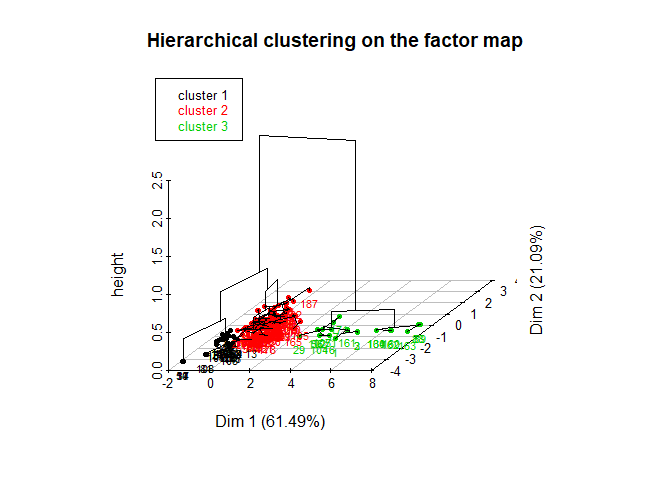
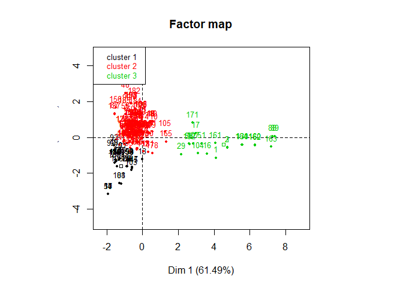

# README

This project contains an analysis of shampoo bottles screwcap data in R.  
The majority of the project consists in exploring the data through descriptive statistics, oulier identification, principal components analysis and clustering. A basic predictive model for the price of screwcaps is also implemented via linear regression.

This work was part of an assignment for a Machine Learning course at École Polytechnique. Only the main results are presented in this README. To see the full work, including code and interpretations of the results below, click here.

Installation
----------------------


```r
#We will need the following packages.
install.packages("dplyr")
install.packages("FactoMineR")
install.packages("ggplot2")
install.packages("plotly")
```

Data
----------------------

The raw dataset ScrewCap.csv contains 195 lots of screw caps described by 11 variables.


```
##   X   Supplier Diameter weight nb.of.pieces   Shape Impermeability
## 1 1 Supplier A    3.780  3.780            2 Shape 1         Type 1
## 2 2 Supplier A    3.994  4.768            3 Shape 2         Type 2
## 3 3 Supplier A    3.994  4.768            3 Shape 2         Type 2
## 4 4 Supplier A    1.066  1.917            4 Shape 2         Type 2
## 5 5 Supplier A    1.179  1.261            5 Shape 3         Type 1
## 6 6 Supplier A    1.079  1.250            5 Shape 2         Type 1
##      Finishing Mature.Volume Raw.Material    Price    Length
## 1   Lacquering         60000           PS 28.19338 30.118312
## 2   Lacquering         49000           PS 35.34190 31.693726
## 3   Lacquering         55000           PS 41.94724 31.738166
## 4   Lacquering          1500           PS 26.76473  8.472485
## 5 Hot Printing        215000           PP 13.84152  9.222997
## 6 Hot Printing         75000           PP 16.02589  8.764609
```

Main results
----------------------


####Principal Components analysis


```r
res.pca <- PCA(screw, scale.unit = TRUE, quali.sup = c(1,5,6,7,9), quanti.sup = 10)
```

<!-- --><!-- -->


####K-means clustering

We perform a clustering along the first 3 first principal components of our data (which retain 99% of the total variance of the data). We choose to fit 2 clusters (elbow method analysis available in full work)


We find the following 3 centroids:


```
##        Dim.1       Dim.2       Dim.3
## 1  4.5230724 -0.39618106  0.15057123
## 2 -0.5458881  0.04781496 -0.01817239
```

Here is a plot of the obtained clustering.


```r
proj <- data.frame(res.pca_3c$ind$coord)
p <- plot_ly(data = proj, x = proj[,1], y = proj[,2], z = proj[,3], color = res.kmeans$cluster, colors = "Set1") %>%
   add_markers() %>%
   layout(
    title = "Clustering on PCA output",
    scene = list(
      xaxis = list(title = "Principal Component 1"),
      yaxis = list(title = "Principal Component 2"),
      zaxis = list(title = "Principal Component 3")
    ))
p
```

<!--html_preserve--><div id="36f060976d09" style="width:672px;height:480px;" class="plotly html-widget"></div>
<script type="application/json" data-for="36f060976d09">{"x":{"visdat":{"36f05c81254a":["function () ","plotlyVisDat"]},"cur_data":"36f05c81254a","attrs":{"36f05c81254a":{"x":[4.10458623987701,4.7467382525855,4.74097802133348,0.00178566583338873,-0.597011938844464,-0.483895264169599,0.219499773699266,0.568981311711342,0.586399378260954,0.611707333631413,-1.92448147832654,0.120430691617342,-0.0155815487342553,-1.90979047031993,0.454812342246029,3.60702230431581,2.96758677795491,0.479537077746675,-0.668856906912485,-1.36272264726307,-1.49856070064354,-0.284491313602503,-0.696463373754258,-0.697668093790357,0.314631292213066,-0.217013300811077,-1.27582025188375,-0.269065573624261,2.17677141100706,-0.234029209216546,-0.862798951561731,-1.0202018085017,0.00242019640493601,-0.678481235081206,-0.673093768651782,-0.568977515010797,-1.9091303748818,-0.216925067500985,-0.282203186926397,-0.0566569642263901,0.00679797024743511,-0.58028934913782,-0.681149671362867,-0.683634887662268,-0.237510941140087,-0.262397168812322,-0.285462804371012,-0.940583177406775,-1.57900508609673,-1.92424841804723,3.29740993077832,-0.735162559260754,-0.743499510242168,-0.711940766994475,-0.756714112296429,2.61415151241171,0.335888786356491,-0.956910302234418,-0.445274584538847,-0.642215503977666,-0.496353309929558,-0.269271809624337,-0.306400000713371,-0.245009041830198,-0.774948640509836,-0.766101029823863,-0.611634984099051,-0.646990233732742,0.105527892303674,-0.524296983465387,-0.325632277901731,-0.309005084395812,-0.867225298638706,-0.504384817600246,-0.169130402412527,-0.540276718165252,-1.09225627961812,-1.25501849983465,-0.77887597423722,-0.261741213965816,-1.19800256904531,-0.303961313986657,-0.856566712147244,-1.02174648737553,-1.02070293230753,-0.346820375485874,-1.55808316127151,7.28632506596498,7.41692777795664,-0.888913059228341,0.55651842298678,-1.73962873070193,-1.58811693757589,-0.524435281631659,-0.480895227365313,-0.473719255637755,-0.500698722257895,-0.72420808653024,-0.710971916798527,-0.706025816842885,-0.110934506084418,2.6268049675575,-0.625947652721579,3.11714279953918,1.28250501256467,-1.41328995820711,2.83727623462185,-1.26936762004334,-1.32923510022167,0.51463875292033,-0.663968586810165,0.0668541562549446,-0.21130436595284,-0.521772213019206,-0.302041534129688,-0.297571017811964,-0.833128131273831,-0.522735920096903,-0.811821304964571,-0.641111546218404,-0.00895988571281902,0.0755884124486402,-0.333810110511468,-1.01929054048292,-1.12510024547881,-0.45448010435429,-0.373692805495741,-0.0899851896223111,-0.861225749394331,5.59051140227302,5.58611162286074,-0.552529422978217,-0.400343553777793,-1.01176352019265,-0.969169925017926,-0.20681485217325,-1.56384954257019,-0.83317983941757,-0.322974323000103,-0.0154140212169587,0.0750149239459288,0.0484601844567514,0.069552930890991,0.10347965009109,-0.575664957395259,-1.2475708149193,-0.569349647094587,-1.48641905255279,-1.51010371971148,-1.54228485558591,-1.49724296768013,-0.347877770333098,-0.302408987638424,-0.33416019728702,-0.88944463920384,-1.49450013286041,-0.82726643757326,-0.606759748736192,-0.670270351364417,6.31289419787344,4.0742051911315,6.29155633955156,7.20694391874647,5.56543363532084,1.32968060042742,-0.301989590767486,-1.05710680357018,-1.06168319121215,-1.02085310005629,-1.00909899379892,2.81714321053252,-0.698431809943594,0.0311374238379323,-0.472764191840116,-1.12424269151029,-1.11567605500367,-1.10891620371626,0.547712092350171,0.438114080129325,0.310210618200018,0.332793830737516,-0.459136940000196,-0.969304923796411,-0.386689717816284,-0.980011443211211,-0.072316531885745,-0.337128530670973,-0.0882799747728222,-0.0900857164454984,-0.0561180848664673,-0.0954460345473727,-0.6201893821446,-0.648041458228524,-0.62740766358463,-0.618176241920063],"y":[-1.15098183389838,-0.557918328334746,-0.584785450231726,0.36514472202939,-0.0118136960923402,0.615923637793048,-0.243415156647809,0.885105664490174,0.884660318111821,0.884013242488609,-3.17553518895392,0.777396832225972,-1.22858775658781,-3.17591080970329,0.875548859191896,-0.913501103344861,0.226718411628995,0.874916695376263,-0.576987060576666,-0.894423996016931,-1.36370287721681,-0.228607117018017,0.120316801993385,0.0528116046020609,0.273514215398536,0.787662133056476,-0.423164326660382,-0.274025523287198,-0.955623070287739,0.743073197186569,0.351081680594272,-0.140157830077084,1.11651244925593,0.052321033618551,0.119719286249242,0.366940433498956,-3.17592768707093,0.742635877260952,0.789970144705419,0.964941338892461,1.07587891816354,0.367229655287531,0.119925260149188,0.0749648024983779,0.743162218358817,0.868255742729545,0.868845486558528,2.47418390758016,-0.705482618357129,-3.1755411478559,-0.338359567179587,-1.25367861816806,-1.25346545840573,-1.25427235462298,-0.788018217446913,-0.364069362025378,0.205284077535065,1.30840704242205,0.938896550054552,1.15466785353245,0.459256939483238,-0.635367290780367,-0.701953994279978,0.268474497328627,0.331188045985717,0.308449829719372,-0.0226194514362293,0.543608536362461,0.280095062756071,-0.262514607351963,-0.271947867313737,0.0217351694587185,-1.63262136328585,-0.263023723041005,0.763956464275781,-0.355472515678969,-0.945851090824209,-1.19042517341864,0.331288460336937,-0.215062099643617,-2.59193868583199,0.0216062099741189,-1.63289388279189,0.17942878952301,0.179402107831973,0.158803001066681,1.32659767134897,0.0597770305950164,0.0544036214962798,1.78081514353987,0.317579009098478,-0.776374518901765,-0.457086374884805,0.939156508332104,0.938043273092959,0.93785979733169,0.938549610274759,-1.27472431579574,-1.27506273913547,-0.282727203696444,1.39468851602269,-0.392080345147613,-1.84298372697472,-0.898939526971662,0.325264614318888,-1.63661847578619,-0.337313918392695,-2.58086854322372,-1.27262688082445,0.706892221239711,0.171731608068543,-0.798497533418024,1.30742478453941,0.439646051897757,-0.634529432107219,-0.702179734349835,-0.32408522746859,-0.262554520732449,-0.302118002016228,0.934396158352646,0.265451218033334,-0.30245760027516,-0.249689629999036,0.336999693662261,0.558384956839691,0.936880717455315,0.793800745682682,1.3716337576676,-1.63277476019245,-0.417192259753794,-0.417079765877322,0.933367678606013,0.128654685651024,0.255714344027882,0.295146907778782,0.312670094440728,1.29522830671283,-1.63349184003597,-0.0319364638517817,-0.0766186983427603,0.236237206762458,0.236916160251694,0.195855259537831,0.276031018452939,-1.72285264319874,-1.19061559636224,-1.6626459345214,-1.27359694606201,-1.27299137478855,-1.44100856459149,-1.27332019942151,0.112850229544227,0.201735680117711,0.0719778977940195,0.12126431776648,1.6643069498842,0.626014476934088,0.356110758050976,0.923481683046919,-0.418313401681163,-0.327591299405059,-0.452041795483582,-0.530206823197895,-0.412058715607551,-0.237446002711272,-0.293820505574547,-0.265177416460352,-0.204278007268089,-0.221080353919475,-0.395150140322393,0.807355233027838,-0.216153010717957,0.146935855998298,0.275841352109951,0.558363030838144,0.558143998459778,0.557971162095853,-0.900398419460273,0.234070860489582,-0.240911539644031,-0.805955277493859,2.15321560782995,1.60323488366409,1.58561619070243,1.60350862872257,1.39560630721484,3.0996182834663,0.322445376372,0.322491545704967,0.321623058857598,0.322628598703742,1.90822378783919,1.9089359117238,1.90840834537824,1.90817231572514],"z":[-0.159631551346028,0.357221083832477,0.391985362647179,-0.634453565680491,0.969057302323994,0.152730375664933,-0.963202547478142,-0.00274239308372404,0.00185700165425824,0.00853979141329539,3.71559343603985,0.0537389063206125,0.301114283649263,3.71947272681698,-0.00843044722247706,-0.605170281992514,0.137732383640786,-0.00190166183543275,-0.695164294861222,-0.413951116549681,0.185172723015528,-1.08877774554263,-0.468445239178438,-0.378050058941006,-0.437512323733824,-0.0271771524664039,-1.0219336759034,-1.02422891079264,-0.835659643015335,0.0288051777038359,-0.766638919480506,-0.142971691542655,0.779765132721575,-0.372983598967741,-0.462274287974933,-0.770420668841906,3.71964703086364,0.0333216778090674,-0.0407819742854929,0.969782092292557,0.835349101016698,-0.773407658827997,-0.464401520434031,-0.404582232320065,0.0278857955529762,-0.141384199892544,-0.147474885245863,1.17915285322499,0.493410279679399,3.71565497767073,-0.230671851145372,-1.01181331007256,-1.01401475581658,-1.00568139015758,-1.63292810532821,-0.346433719441781,-0.341954534481024,0.334308170557309,-0.275172888453138,0.604600849700111,1.55152584335729,-0.547847843395749,-0.46693857385112,-0.5385510732355,0.469947768467548,0.502521824173533,-0.225201490301834,0.211190218829574,-0.486502595420616,1.31368102541229,-1.03500705778732,-0.228399135713033,-0.529742845305457,1.31893900916388,0.0165286824868078,-0.965490444211674,0.911001781131214,0.00551765428091655,0.468910721213848,-1.09630290634377,0.684360005164905,-0.227067283465633,-0.526928351143116,-0.575402087250439,-0.575126527292341,-0.413495403328165,0.188429950123926,1.23240437227379,1.25312918216186,0.912037891943623,-0.448183506895503,0.555002057774068,0.161097076623202,-0.289920167350355,-0.27842303040271,-0.276528151513045,-0.283652318621535,0.220470490262276,0.223965618107934,-1.09523743911758,0.382553049208763,-0.270347060854544,-0.201574096943459,-0.72597037790268,-0.315830917519176,0.568479988829139,-0.319386404394713,0.654611147656807,1.29665046021698,0.228237045227285,1.90621722100364,-1.45477818445798,0.477760443309094,1.5720277460402,-0.556500979381062,-0.464607202720875,-1.06674652005156,1.31409323802052,-1.09135802960194,-0.321506777862021,-0.490437592561039,-0.916102990627877,-1.07117846180807,-0.78672583043579,0.0976595347449759,-0.274579910915963,1.13034894974937,0.41882285082368,-0.528158611191628,0.334196999568572,0.333035198847495,-0.287367317631673,-0.385295800549762,-0.675574399880682,-0.718755162178268,-0.58771771370249,0.229240158113185,-0.520752840269716,-0.159517199100834,-0.0316678063692487,-0.431117962921748,-0.438129977069652,-0.378132272223173,-0.478029578220908,-0.353031549880231,0.00748428144428435,-0.432449528882673,0.0698673168276419,0.0636131706978007,0.281898699835242,0.067009166174739,-0.359914527432832,-0.468859155638614,-0.301864302438758,0.713557723610648,0.949277734045388,0.067369023577579,-0.728165087515117,-0.296944499619418,0.507033401972114,-0.087741611376601,0.521614166703317,0.803904523532172,0.321491372911606,-0.755927675568769,-0.992702691439967,-1.18833878455367,-1.27118918775142,-1.23924120454329,-1.00518107961364,0.549260211907455,-1.18977898188841,-0.324878359213846,-0.590308072780688,0.0978859794654105,0.100148075706604,0.10193307430862,-1.22573893846874,-0.356130943763041,-0.952385280303954,-1.38589396364896,1.70629301550944,1.1361272362847,1.27743222115585,1.13330008500942,1.59342382109573,2.86747124250257,-0.578255485802419,-0.578732307883895,-0.569762853926343,-0.580147747353106,0.798656155379705,0.791301568013914,0.79675010423574,0.799187742885654],"color":[1,1,1,2,2,2,2,2,2,2,2,2,2,2,2,1,1,2,2,2,2,2,2,2,2,2,2,2,1,2,2,2,2,2,2,2,2,2,2,2,2,2,2,2,2,2,2,2,2,2,1,2,2,2,2,1,2,2,2,2,2,2,2,2,2,2,2,2,2,2,2,2,2,2,2,2,2,2,2,2,2,2,2,2,2,2,2,1,1,2,2,2,2,2,2,2,2,2,2,2,2,1,2,1,2,2,1,2,2,2,2,2,2,2,2,2,2,2,2,2,2,2,2,2,2,2,2,2,2,1,1,2,2,2,2,2,2,2,2,2,2,2,2,2,2,2,2,2,2,2,2,2,2,2,2,2,2,2,2,1,1,1,1,1,2,2,2,2,2,2,1,2,2,2,2,2,2,2,2,2,2,2,2,2,2,2,2,2,2,2,2,2,2,2,2],"colors":"Set1","alpha":1,"sizes":[10,100],"type":"scatter3d","mode":"markers"}},"layout":{"margin":{"b":40,"l":60,"t":25,"r":10},"title":"Clustering on PCA output","scene":{"xaxis":{"title":"Principal Component 1"},"yaxis":{"title":"Principal Component 2"},"zaxis":{"title":"Principal Component 3"}},"xaxis":{"domain":[0,1]},"yaxis":{"domain":[0,1]},"hovermode":"closest","showlegend":false,"legend":{"y":0.5,"yanchor":"top"}},"source":"A","config":{"modeBarButtonsToAdd":[{"name":"Collaborate","icon":{"width":1000,"ascent":500,"descent":-50,"path":"M487 375c7-10 9-23 5-36l-79-259c-3-12-11-23-22-31-11-8-22-12-35-12l-263 0c-15 0-29 5-43 15-13 10-23 23-28 37-5 13-5 25-1 37 0 0 0 3 1 7 1 5 1 8 1 11 0 2 0 4-1 6 0 3-1 5-1 6 1 2 2 4 3 6 1 2 2 4 4 6 2 3 4 5 5 7 5 7 9 16 13 26 4 10 7 19 9 26 0 2 0 5 0 9-1 4-1 6 0 8 0 2 2 5 4 8 3 3 5 5 5 7 4 6 8 15 12 26 4 11 7 19 7 26 1 1 0 4 0 9-1 4-1 7 0 8 1 2 3 5 6 8 4 4 6 6 6 7 4 5 8 13 13 24 4 11 7 20 7 28 1 1 0 4 0 7-1 3-1 6-1 7 0 2 1 4 3 6 1 1 3 4 5 6 2 3 3 5 5 6 1 2 3 5 4 9 2 3 3 7 5 10 1 3 2 6 4 10 2 4 4 7 6 9 2 3 4 5 7 7 3 2 7 3 11 3 3 0 8 0 13-1l0-1c7 2 12 2 14 2l218 0c14 0 25-5 32-16 8-10 10-23 6-37l-79-259c-7-22-13-37-20-43-7-7-19-10-37-10l-248 0c-5 0-9-2-11-5-2-3-2-7 0-12 4-13 18-20 41-20l264 0c5 0 10 2 16 5 5 3 8 6 10 11l85 282c2 5 2 10 2 17 7-3 13-7 17-13z m-304 0c-1-3-1-5 0-7 1-1 3-2 6-2l174 0c2 0 4 1 7 2 2 2 4 4 5 7l6 18c0 3 0 5-1 7-1 1-3 2-6 2l-173 0c-3 0-5-1-8-2-2-2-4-4-4-7z m-24-73c-1-3-1-5 0-7 2-2 3-2 6-2l174 0c2 0 5 0 7 2 3 2 4 4 5 7l6 18c1 2 0 5-1 6-1 2-3 3-5 3l-174 0c-3 0-5-1-7-3-3-1-4-4-5-6z"},"click":"function(gd) { \n        // is this being viewed in RStudio?\n        if (location.search == '?viewer_pane=1') {\n          alert('To learn about plotly for collaboration, visit:\\n https://cpsievert.github.io/plotly_book/plot-ly-for-collaboration.html');\n        } else {\n          window.open('https://cpsievert.github.io/plotly_book/plot-ly-for-collaboration.html', '_blank');\n        }\n      }"}],"cloud":false},"data":[{"x":[4.10458623987701,4.7467382525855,4.74097802133348,0.00178566583338873,-0.597011938844464,-0.483895264169599,0.219499773699266,0.568981311711342,0.586399378260954,0.611707333631413,-1.92448147832654,0.120430691617342,-0.0155815487342553,-1.90979047031993,0.454812342246029,3.60702230431581,2.96758677795491,0.479537077746675,-0.668856906912485,-1.36272264726307,-1.49856070064354,-0.284491313602503,-0.696463373754258,-0.697668093790357,0.314631292213066,-0.217013300811077,-1.27582025188375,-0.269065573624261,2.17677141100706,-0.234029209216546,-0.862798951561731,-1.0202018085017,0.00242019640493601,-0.678481235081206,-0.673093768651782,-0.568977515010797,-1.9091303748818,-0.216925067500985,-0.282203186926397,-0.0566569642263901,0.00679797024743511,-0.58028934913782,-0.681149671362867,-0.683634887662268,-0.237510941140087,-0.262397168812322,-0.285462804371012,-0.940583177406775,-1.57900508609673,-1.92424841804723,3.29740993077832,-0.735162559260754,-0.743499510242168,-0.711940766994475,-0.756714112296429,2.61415151241171,0.335888786356491,-0.956910302234418,-0.445274584538847,-0.642215503977666,-0.496353309929558,-0.269271809624337,-0.306400000713371,-0.245009041830198,-0.774948640509836,-0.766101029823863,-0.611634984099051,-0.646990233732742,0.105527892303674,-0.524296983465387,-0.325632277901731,-0.309005084395812,-0.867225298638706,-0.504384817600246,-0.169130402412527,-0.540276718165252,-1.09225627961812,-1.25501849983465,-0.77887597423722,-0.261741213965816,-1.19800256904531,-0.303961313986657,-0.856566712147244,-1.02174648737553,-1.02070293230753,-0.346820375485874,-1.55808316127151,7.28632506596498,7.41692777795664,-0.888913059228341,0.55651842298678,-1.73962873070193,-1.58811693757589,-0.524435281631659,-0.480895227365313,-0.473719255637755,-0.500698722257895,-0.72420808653024,-0.710971916798527,-0.706025816842885,-0.110934506084418,2.6268049675575,-0.625947652721579,3.11714279953918,1.28250501256467,-1.41328995820711,2.83727623462185,-1.26936762004334,-1.32923510022167,0.51463875292033,-0.663968586810165,0.0668541562549446,-0.21130436595284,-0.521772213019206,-0.302041534129688,-0.297571017811964,-0.833128131273831,-0.522735920096903,-0.811821304964571,-0.641111546218404,-0.00895988571281902,0.0755884124486402,-0.333810110511468,-1.01929054048292,-1.12510024547881,-0.45448010435429,-0.373692805495741,-0.0899851896223111,-0.861225749394331,5.59051140227302,5.58611162286074,-0.552529422978217,-0.400343553777793,-1.01176352019265,-0.969169925017926,-0.20681485217325,-1.56384954257019,-0.83317983941757,-0.322974323000103,-0.0154140212169587,0.0750149239459288,0.0484601844567514,0.069552930890991,0.10347965009109,-0.575664957395259,-1.2475708149193,-0.569349647094587,-1.48641905255279,-1.51010371971148,-1.54228485558591,-1.49724296768013,-0.347877770333098,-0.302408987638424,-0.33416019728702,-0.88944463920384,-1.49450013286041,-0.82726643757326,-0.606759748736192,-0.670270351364417,6.31289419787344,4.0742051911315,6.29155633955156,7.20694391874647,5.56543363532084,1.32968060042742,-0.301989590767486,-1.05710680357018,-1.06168319121215,-1.02085310005629,-1.00909899379892,2.81714321053252,-0.698431809943594,0.0311374238379323,-0.472764191840116,-1.12424269151029,-1.11567605500367,-1.10891620371626,0.547712092350171,0.438114080129325,0.310210618200018,0.332793830737516,-0.459136940000196,-0.969304923796411,-0.386689717816284,-0.980011443211211,-0.072316531885745,-0.337128530670973,-0.0882799747728222,-0.0900857164454984,-0.0561180848664673,-0.0954460345473727,-0.6201893821446,-0.648041458228524,-0.62740766358463,-0.618176241920063],"y":[-1.15098183389838,-0.557918328334746,-0.584785450231726,0.36514472202939,-0.0118136960923402,0.615923637793048,-0.243415156647809,0.885105664490174,0.884660318111821,0.884013242488609,-3.17553518895392,0.777396832225972,-1.22858775658781,-3.17591080970329,0.875548859191896,-0.913501103344861,0.226718411628995,0.874916695376263,-0.576987060576666,-0.894423996016931,-1.36370287721681,-0.228607117018017,0.120316801993385,0.0528116046020609,0.273514215398536,0.787662133056476,-0.423164326660382,-0.274025523287198,-0.955623070287739,0.743073197186569,0.351081680594272,-0.140157830077084,1.11651244925593,0.052321033618551,0.119719286249242,0.366940433498956,-3.17592768707093,0.742635877260952,0.789970144705419,0.964941338892461,1.07587891816354,0.367229655287531,0.119925260149188,0.0749648024983779,0.743162218358817,0.868255742729545,0.868845486558528,2.47418390758016,-0.705482618357129,-3.1755411478559,-0.338359567179587,-1.25367861816806,-1.25346545840573,-1.25427235462298,-0.788018217446913,-0.364069362025378,0.205284077535065,1.30840704242205,0.938896550054552,1.15466785353245,0.459256939483238,-0.635367290780367,-0.701953994279978,0.268474497328627,0.331188045985717,0.308449829719372,-0.0226194514362293,0.543608536362461,0.280095062756071,-0.262514607351963,-0.271947867313737,0.0217351694587185,-1.63262136328585,-0.263023723041005,0.763956464275781,-0.355472515678969,-0.945851090824209,-1.19042517341864,0.331288460336937,-0.215062099643617,-2.59193868583199,0.0216062099741189,-1.63289388279189,0.17942878952301,0.179402107831973,0.158803001066681,1.32659767134897,0.0597770305950164,0.0544036214962798,1.78081514353987,0.317579009098478,-0.776374518901765,-0.457086374884805,0.939156508332104,0.938043273092959,0.93785979733169,0.938549610274759,-1.27472431579574,-1.27506273913547,-0.282727203696444,1.39468851602269,-0.392080345147613,-1.84298372697472,-0.898939526971662,0.325264614318888,-1.63661847578619,-0.337313918392695,-2.58086854322372,-1.27262688082445,0.706892221239711,0.171731608068543,-0.798497533418024,1.30742478453941,0.439646051897757,-0.634529432107219,-0.702179734349835,-0.32408522746859,-0.262554520732449,-0.302118002016228,0.934396158352646,0.265451218033334,-0.30245760027516,-0.249689629999036,0.336999693662261,0.558384956839691,0.936880717455315,0.793800745682682,1.3716337576676,-1.63277476019245,-0.417192259753794,-0.417079765877322,0.933367678606013,0.128654685651024,0.255714344027882,0.295146907778782,0.312670094440728,1.29522830671283,-1.63349184003597,-0.0319364638517817,-0.0766186983427603,0.236237206762458,0.236916160251694,0.195855259537831,0.276031018452939,-1.72285264319874,-1.19061559636224,-1.6626459345214,-1.27359694606201,-1.27299137478855,-1.44100856459149,-1.27332019942151,0.112850229544227,0.201735680117711,0.0719778977940195,0.12126431776648,1.6643069498842,0.626014476934088,0.356110758050976,0.923481683046919,-0.418313401681163,-0.327591299405059,-0.452041795483582,-0.530206823197895,-0.412058715607551,-0.237446002711272,-0.293820505574547,-0.265177416460352,-0.204278007268089,-0.221080353919475,-0.395150140322393,0.807355233027838,-0.216153010717957,0.146935855998298,0.275841352109951,0.558363030838144,0.558143998459778,0.557971162095853,-0.900398419460273,0.234070860489582,-0.240911539644031,-0.805955277493859,2.15321560782995,1.60323488366409,1.58561619070243,1.60350862872257,1.39560630721484,3.0996182834663,0.322445376372,0.322491545704967,0.321623058857598,0.322628598703742,1.90822378783919,1.9089359117238,1.90840834537824,1.90817231572514],"z":[-0.159631551346028,0.357221083832477,0.391985362647179,-0.634453565680491,0.969057302323994,0.152730375664933,-0.963202547478142,-0.00274239308372404,0.00185700165425824,0.00853979141329539,3.71559343603985,0.0537389063206125,0.301114283649263,3.71947272681698,-0.00843044722247706,-0.605170281992514,0.137732383640786,-0.00190166183543275,-0.695164294861222,-0.413951116549681,0.185172723015528,-1.08877774554263,-0.468445239178438,-0.378050058941006,-0.437512323733824,-0.0271771524664039,-1.0219336759034,-1.02422891079264,-0.835659643015335,0.0288051777038359,-0.766638919480506,-0.142971691542655,0.779765132721575,-0.372983598967741,-0.462274287974933,-0.770420668841906,3.71964703086364,0.0333216778090674,-0.0407819742854929,0.969782092292557,0.835349101016698,-0.773407658827997,-0.464401520434031,-0.404582232320065,0.0278857955529762,-0.141384199892544,-0.147474885245863,1.17915285322499,0.493410279679399,3.71565497767073,-0.230671851145372,-1.01181331007256,-1.01401475581658,-1.00568139015758,-1.63292810532821,-0.346433719441781,-0.341954534481024,0.334308170557309,-0.275172888453138,0.604600849700111,1.55152584335729,-0.547847843395749,-0.46693857385112,-0.5385510732355,0.469947768467548,0.502521824173533,-0.225201490301834,0.211190218829574,-0.486502595420616,1.31368102541229,-1.03500705778732,-0.228399135713033,-0.529742845305457,1.31893900916388,0.0165286824868078,-0.965490444211674,0.911001781131214,0.00551765428091655,0.468910721213848,-1.09630290634377,0.684360005164905,-0.227067283465633,-0.526928351143116,-0.575402087250439,-0.575126527292341,-0.413495403328165,0.188429950123926,1.23240437227379,1.25312918216186,0.912037891943623,-0.448183506895503,0.555002057774068,0.161097076623202,-0.289920167350355,-0.27842303040271,-0.276528151513045,-0.283652318621535,0.220470490262276,0.223965618107934,-1.09523743911758,0.382553049208763,-0.270347060854544,-0.201574096943459,-0.72597037790268,-0.315830917519176,0.568479988829139,-0.319386404394713,0.654611147656807,1.29665046021698,0.228237045227285,1.90621722100364,-1.45477818445798,0.477760443309094,1.5720277460402,-0.556500979381062,-0.464607202720875,-1.06674652005156,1.31409323802052,-1.09135802960194,-0.321506777862021,-0.490437592561039,-0.916102990627877,-1.07117846180807,-0.78672583043579,0.0976595347449759,-0.274579910915963,1.13034894974937,0.41882285082368,-0.528158611191628,0.334196999568572,0.333035198847495,-0.287367317631673,-0.385295800549762,-0.675574399880682,-0.718755162178268,-0.58771771370249,0.229240158113185,-0.520752840269716,-0.159517199100834,-0.0316678063692487,-0.431117962921748,-0.438129977069652,-0.378132272223173,-0.478029578220908,-0.353031549880231,0.00748428144428435,-0.432449528882673,0.0698673168276419,0.0636131706978007,0.281898699835242,0.067009166174739,-0.359914527432832,-0.468859155638614,-0.301864302438758,0.713557723610648,0.949277734045388,0.067369023577579,-0.728165087515117,-0.296944499619418,0.507033401972114,-0.087741611376601,0.521614166703317,0.803904523532172,0.321491372911606,-0.755927675568769,-0.992702691439967,-1.18833878455367,-1.27118918775142,-1.23924120454329,-1.00518107961364,0.549260211907455,-1.18977898188841,-0.324878359213846,-0.590308072780688,0.0978859794654105,0.100148075706604,0.10193307430862,-1.22573893846874,-0.356130943763041,-0.952385280303954,-1.38589396364896,1.70629301550944,1.1361272362847,1.27743222115585,1.13330008500942,1.59342382109573,2.86747124250257,-0.578255485802419,-0.578732307883895,-0.569762853926343,-0.580147747353106,0.798656155379705,0.791301568013914,0.79675010423574,0.799187742885654],"type":"scatter3d","mode":"markers","marker":{"colorbar":{"title":"","ticklen":2},"cmin":1,"cmax":2,"colorscale":[["0","rgba(228,26,28,1)"],["1","rgba(153,153,153,1)"]],"showscale":false,"color":[1,1,1,2,2,2,2,2,2,2,2,2,2,2,2,1,1,2,2,2,2,2,2,2,2,2,2,2,1,2,2,2,2,2,2,2,2,2,2,2,2,2,2,2,2,2,2,2,2,2,1,2,2,2,2,1,2,2,2,2,2,2,2,2,2,2,2,2,2,2,2,2,2,2,2,2,2,2,2,2,2,2,2,2,2,2,2,1,1,2,2,2,2,2,2,2,2,2,2,2,2,1,2,1,2,2,1,2,2,2,2,2,2,2,2,2,2,2,2,2,2,2,2,2,2,2,2,2,2,1,1,2,2,2,2,2,2,2,2,2,2,2,2,2,2,2,2,2,2,2,2,2,2,2,2,2,2,2,2,1,1,1,1,1,2,2,2,2,2,2,1,2,2,2,2,2,2,2,2,2,2,2,2,2,2,2,2,2,2,2,2,2,2,2,2],"line":{"color":"transparent"}},"frame":null},{"x":[-1.92448147832654,7.41692777795664],"y":[-3.17592768707093,3.0996182834663],"type":"scatter3d","mode":"markers","opacity":0,"hoverinfo":"none","showlegend":false,"marker":{"colorbar":{"title":"","ticklen":2,"len":0.5,"y":1,"lenmode":"fraction","yanchor":"top"},"cmin":1,"cmax":2,"colorscale":[["0","rgba(228,26,28,1)"],["1","rgba(153,153,153,1)"]],"showscale":true,"color":[1,2]},"z":[-1.63292810532821,3.71964703086364],"frame":null}],"highlight":{"on":"plotly_click","persistent":false,"dynamic":false,"selectize":false,"opacityDim":0.2,"selected":{"opacity":1}},"base_url":"https://plot.ly"},"evals":["config.modeBarButtonsToAdd.0.click"],"jsHooks":{"render":[{"code":"function(el, x) { var ctConfig = crosstalk.var('plotlyCrosstalkOpts').set({\"on\":\"plotly_click\",\"persistent\":false,\"dynamic\":false,\"selectize\":false,\"opacityDim\":0.2,\"selected\":{\"opacity\":1}}); }","data":null}]}}</script><!--/html_preserve-->


####Hierarchical clustering

We also try another clustering method on our data: Agglomerated Hierachical Clustering. This time we choose the number of clusters with the higher relative loss of inertia.

<!-- --><!-- --><!-- -->


####Linear regression

Finally, we fit a linear regression model (without interaction terms) on our data to predict the unit Price of screwcaps.  

The best model found using a step-wise approach is the following:


```r
res.lm2 <- lm(data = screw, formula = Price ~ Supplier + Diameter + nb.of.pieces + Shape + Impermeability + Mature.Volume + Raw.Material)
summary(res.lm2)
```

```
## 
## Call:
## lm(formula = Price ~ Supplier + Diameter + nb.of.pieces + Shape + 
##     Impermeability + Mature.Volume + Raw.Material, data = screw)
## 
## Residuals:
##      Min       1Q   Median       3Q      Max 
## -11.9765  -2.1351  -0.1484   1.7410  17.0579 
## 
## Coefficients:
##                        Estimate Std. Error t value Pr(>|t|)    
## (Intercept)           9.009e+00  1.623e+00   5.551 9.86e-08 ***
## SupplierSupplier B   -7.701e-01  7.803e-01  -0.987 0.325004    
## SupplierSupplier C   -2.805e+00  1.368e+00  -2.050 0.041795 *  
## Diameter              4.745e+00  4.110e-01  11.544  < 2e-16 ***
## nb.of.pieces          9.203e-01  2.500e-01   3.681 0.000305 ***
## ShapeShape 2         -4.773e-01  9.146e-01  -0.522 0.602371    
## ShapeShape 3          1.985e+00  1.369e+00   1.450 0.148834    
## ShapeShape 4          5.414e+00  1.465e+00   3.697 0.000289 ***
## ImpermeabilityType 2  6.051e+00  1.482e+00   4.084 6.61e-05 ***
## Mature.Volume        -4.660e-06  2.136e-06  -2.182 0.030419 *  
## Raw.MaterialPP       -2.197e+00  9.596e-01  -2.289 0.023217 *  
## Raw.MaterialPS       -3.291e+00  1.361e+00  -2.418 0.016597 *  
## ---
## Signif. codes:  0 '***' 0.001 '**' 0.01 '*' 0.05 '.' 0.1 ' ' 1
## 
## Residual standard error: 3.733 on 183 degrees of freedom
## Multiple R-squared:  0.7435,	Adjusted R-squared:  0.7281 
## F-statistic: 48.22 on 11 and 183 DF,  p-value: < 2.2e-16
```


