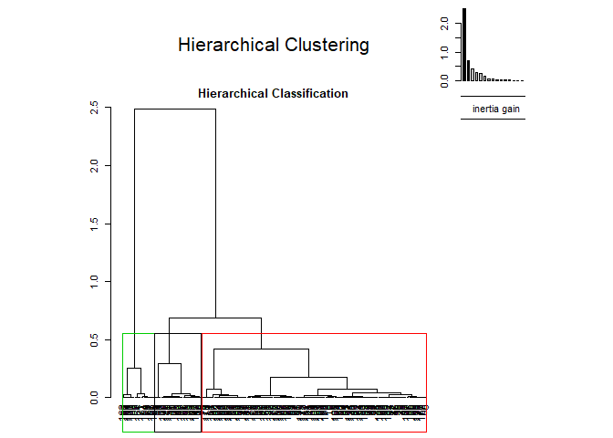

# README

This project contains an analysis of shampoo bottles screwcap data in R.  
The majority of the project consists in exploring the data through descriptive statistics, oulier identification, principal components analysis and clustering. A basic predictive model for the price of screwcaps is also implemented via linear regression.

This work was part of an assignment for a Machine Learning course at École Polytechnique. Only the main results are presented in this README. To see the full work, including code and interpretations of the results below, click [here](full_analysis.md).

Motivation
----------------------

A common approach to determine the cost of products is the **should cost method**. It consists in estimating what a product should cost based on materials, labor, overhead, and profit margin. Although this strategy is very accurate, it has the drawback of being tedious and it requires expert knowledge of industrial technologies and processes. To get a quick estimation, it is possible to build a statistical model to predict the price of products given their characteristics. With such a model, it would no longer be necessary to be an expert or to wait several days to assess the impact of a design modification, a change in supplier or a change in production site.  
Before builing a model, it is important to explore the data. This "data exploration" is the main focus of my project, though a basic predictive model is built at the end.

Installation
----------------------


```r
#We will need the following packages.
install.packages("dplyr")
install.packages("FactoMineR")
install.packages("ggplot2")
install.packages("scatterplot3d")
```

Data
----------------------

The raw dataset ScrewCap.csv contains 195 lots of screw caps described by 11 variables.


```
##   X   Supplier Diameter weight nb.of.pieces   Shape Impermeability
## 1 1 Supplier A    3.780  3.780            2 Shape 1         Type 1
## 2 2 Supplier A    3.994  4.768            3 Shape 2         Type 2
## 3 3 Supplier A    3.994  4.768            3 Shape 2         Type 2
## 4 4 Supplier A    1.066  1.917            4 Shape 2         Type 2
## 5 5 Supplier A    1.179  1.261            5 Shape 3         Type 1
## 6 6 Supplier A    1.079  1.250            5 Shape 2         Type 1
##      Finishing Mature.Volume Raw.Material    Price    Length
## 1   Lacquering         60000           PS 28.19338 30.118312
## 2   Lacquering         49000           PS 35.34190 31.693726
## 3   Lacquering         55000           PS 41.94724 31.738166
## 4   Lacquering          1500           PS 26.76473  8.472485
## 5 Hot Printing        215000           PP 13.84152  9.222997
## 6 Hot Printing         75000           PP 16.02589  8.764609
```

Main results
----------------------


**Principal Components analysis**


```r
res.pca <- PCA(screw, scale.unit = TRUE, quali.sup = c(1,5,6,7,9), quanti.sup = 10)
```

<!-- --><!-- -->


**K-means clustering**

We perform a clustering along the first 3 first principal components of our data (which retain 99% of the total variance of the data). We choose to fit 2 clusters (elbow method analysis available in full work)


We find the following 3 centroids:


```
##        Dim.1       Dim.2       Dim.3
## 1  4.5230724 -0.39618106  0.15057123
## 2 -0.5458881  0.04781496 -0.01817239
```

Here is a plot of the obtained clustering.


```r
proj <- data.frame(res.pca_3c$ind$coord)

scatterplot3d(x = proj[,1], y = proj[,2], z = proj[,3], color = res.kmeans$cluster,
              xlab="Principal Component 1" , ylab="Principal Component 2" , zlab="Principal Component 3" )
```

<!-- -->


**Hierarchical clustering**

We also try another clustering method on our data: Agglomerated Hierachical Clustering. This time we choose the number of clusters with the higher relative loss of inertia. We end up with 3 clusters.

<!-- --><!-- --><!-- -->


**Linear regression**

Finally, we fit a linear regression model (without interaction terms) on our data to predict the unit Price of screwcaps.  

The best model found using a step-wise approach is the following:


```r
res.lm2 <- lm(data = screw, formula = Price ~ Supplier + Diameter + nb.of.pieces + Shape + Impermeability + Mature.Volume + Raw.Material)
summary(res.lm2)
```

```
## 
## Call:
## lm(formula = Price ~ Supplier + Diameter + nb.of.pieces + Shape + 
##     Impermeability + Mature.Volume + Raw.Material, data = screw)
## 
## Residuals:
##      Min       1Q   Median       3Q      Max 
## -11.9765  -2.1351  -0.1484   1.7410  17.0579 
## 
## Coefficients:
##                        Estimate Std. Error t value Pr(>|t|)    
## (Intercept)           9.009e+00  1.623e+00   5.551 9.86e-08 ***
## SupplierSupplier B   -7.701e-01  7.803e-01  -0.987 0.325004    
## SupplierSupplier C   -2.805e+00  1.368e+00  -2.050 0.041795 *  
## Diameter              4.745e+00  4.110e-01  11.544  < 2e-16 ***
## nb.of.pieces          9.203e-01  2.500e-01   3.681 0.000305 ***
## ShapeShape 2         -4.773e-01  9.146e-01  -0.522 0.602371    
## ShapeShape 3          1.985e+00  1.369e+00   1.450 0.148834    
## ShapeShape 4          5.414e+00  1.465e+00   3.697 0.000289 ***
## ImpermeabilityType 2  6.051e+00  1.482e+00   4.084 6.61e-05 ***
## Mature.Volume        -4.660e-06  2.136e-06  -2.182 0.030419 *  
## Raw.MaterialPP       -2.197e+00  9.596e-01  -2.289 0.023217 *  
## Raw.MaterialPS       -3.291e+00  1.361e+00  -2.418 0.016597 *  
## ---
## Signif. codes:  0 '***' 0.001 '**' 0.01 '*' 0.05 '.' 0.1 ' ' 1
## 
## Residual standard error: 3.733 on 183 degrees of freedom
## Multiple R-squared:  0.7435,	Adjusted R-squared:  0.7281 
## F-statistic: 48.22 on 11 and 183 DF,  p-value: < 2.2e-16
```


**See the rest of the analysis in the [full analysis notebook](full_analysis.md)**


