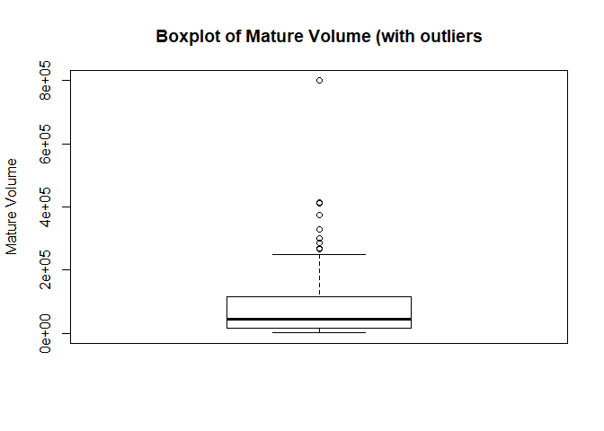
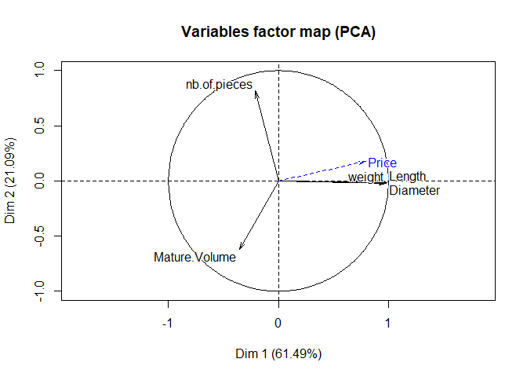
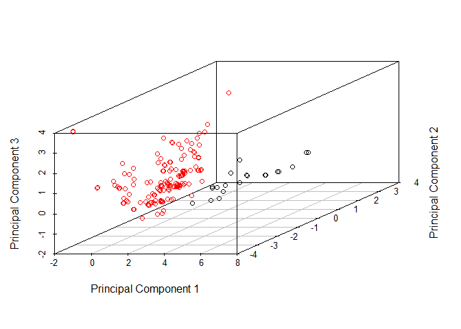
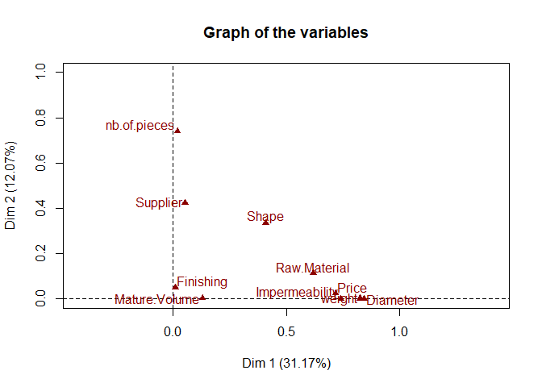
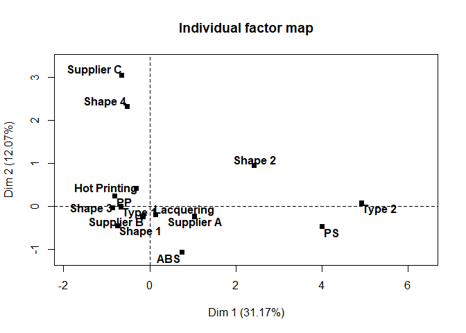
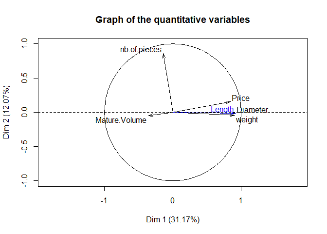

# Easy Cost
Clement Ponsonnet  

##Preparation

Load libraries


```r
library(dplyr)
library(FactoMineR)
library(ggplot2)
library(plotly)
```


Load the data, and have a look at it.


```r
screw <- read.csv("ScrewCaps.csv")
#Take out the first column (it is just indices)
screw <- screw[-1]
head(screw)
```

```
##     Supplier Diameter weight nb.of.pieces   Shape Impermeability
## 1 Supplier A    3.780  3.780            2 Shape 1         Type 1
## 2 Supplier A    3.994  4.768            3 Shape 2         Type 2
## 3 Supplier A    3.994  4.768            3 Shape 2         Type 2
## 4 Supplier A    1.066  1.917            4 Shape 2         Type 2
## 5 Supplier A    1.179  1.261            5 Shape 3         Type 1
## 6 Supplier A    1.079  1.250            5 Shape 2         Type 1
##      Finishing Mature.Volume Raw.Material    Price    Length
## 1   Lacquering         60000           PS 28.19338 30.118312
## 2   Lacquering         49000           PS 35.34190 31.693726
## 3   Lacquering         55000           PS 41.94724 31.738166
## 4   Lacquering          1500           PS 26.76473  8.472485
## 5 Hot Printing        215000           PP 13.84152  9.222997
## 6 Hot Printing         75000           PP 16.02589  8.764609
```

```r
summary(screw)
```

```
##        Supplier      Diameter          weight       nb.of.pieces   
##  Supplier A: 31   Min.   :0.4458   Min.   :0.610   Min.   : 2.000  
##  Supplier B:150   1st Qu.:0.7785   1st Qu.:1.083   1st Qu.: 3.000  
##  Supplier C: 14   Median :1.0120   Median :1.400   Median : 4.000  
##                   Mean   :1.2843   Mean   :1.701   Mean   : 4.113  
##                   3rd Qu.:1.2886   3rd Qu.:1.704   3rd Qu.: 5.000  
##                   Max.   :5.3950   Max.   :7.112   Max.   :10.000  
##      Shape     Impermeability        Finishing   Mature.Volume   
##  Shape 1:134   Type 1:172     Hot Printing: 62   Min.   :  1000  
##  Shape 2: 45   Type 2: 23     Lacquering  :133   1st Qu.: 15000  
##  Shape 3:  8                                     Median : 45000  
##  Shape 4:  8                                     Mean   : 96930  
##                                                  3rd Qu.:115000  
##                                                  Max.   :800000  
##  Raw.Material     Price            Length      
##  ABS: 21      Min.   : 6.477   Min.   : 3.369  
##  PP :148      1st Qu.:11.807   1st Qu.: 6.161  
##  PS : 26      Median :14.384   Median : 8.086  
##               Mean   :16.444   Mean   :10.247  
##               3rd Qu.:18.902   3rd Qu.:10.340  
##               Max.   :46.610   Max.   :43.359
```

##Questions

**2) We start with univariate and bivariate descriptive statistics. Using appropriate plot(s) or summaries** 
**answer the following questions**

* *How is the distribution of the Price? Comment your plot with respect to the quartiles of the Price*

```r
plot(density(screw$Price), xlab = "Price", main="Price distribution")
```

<!-- -->

```r
boxplot(screw$Price, ylab = "Price", main = "Boxplot of Price")
```

<!-- -->

The distribution is not symmetric: its right tail is longer than the left tail. We see this in the quartiles as well: the distance between the distance between the quartiles increases. The distribution has a peak around a price of 15, and another much smaller peak around 30. 
This looks like it could be a mixture of two gaussian randon variables

* *Does the Price depend on the Length? weight?*

```r
cor(screw$Price, screw$Length)
```

```
## [1] 0.7997892
```

```r
cor(screw$Price, screw$weight)
```

```
## [1] 0.787921
```

```r
cor(screw$Length,screw$weight)
```

```
## [1] 0.9629389
```
There appears to be a positive relationship between Price and both Length and weight. We should note that Length and weight are very highly correlated.

* *Does the Price depend on the Impermeability? Shape?*

```r
summary(lm(screw$Price ~ screw$Impermeability))
```

```
## 
## Call:
## lm(formula = screw$Price ~ screw$Impermeability)
## 
## Residuals:
##      Min       1Q   Median       3Q      Max 
## -16.4106  -3.0187  -0.6286   2.4897  25.0638 
## 
## Coefficients:
##                            Estimate Std. Error t value Pr(>|t|)    
## (Intercept)                 14.7236     0.4117   35.77   <2e-16 ***
## screw$ImpermeabilityType 2  14.5846     1.1986   12.17   <2e-16 ***
## ---
## Signif. codes:  0 '***' 0.001 '**' 0.01 '*' 0.05 '.' 0.1 ' ' 1
## 
## Residual standard error: 5.399 on 193 degrees of freedom
## Multiple R-squared:  0.4341,	Adjusted R-squared:  0.4312 
## F-statistic:   148 on 1 and 193 DF,  p-value: < 2.2e-16
```

```r
summary(lm(screw$Price ~ screw$Shape))
```

```
## 
## Call:
## lm(formula = screw$Price ~ screw$Shape)
## 
## Residuals:
##     Min      1Q  Median      3Q     Max 
## -11.098  -3.850  -1.025   3.055  25.587 
## 
## Coefficients:
##                    Estimate Std. Error t value Pr(>|t|)    
## (Intercept)         14.2006     0.5406  26.267  < 2e-16 ***
## screw$ShapeShape 2   8.1403     1.0782   7.550 1.75e-12 ***
## screw$ShapeShape 3   1.4510     2.2777   0.637  0.52485    
## screw$ShapeShape 4   7.4393     2.2777   3.266  0.00129 ** 
## ---
## Signif. codes:  0 '***' 0.001 '**' 0.01 '*' 0.05 '.' 0.1 ' ' 1
## 
## Residual standard error: 6.258 on 191 degrees of freedom
## Multiple R-squared:  0.2475,	Adjusted R-squared:  0.2357 
## F-statistic: 20.94 on 3 and 191 DF,  p-value: 9.008e-12
```
The F-statistic is a measure of the difference between our linear model and an intercept only model. Because it is in both cases very significant, we can say that Price depends on both Impermeability and Shape

* *Which is the less expensive Supplier?*


```r
screw %>%
  group_by(Supplier)%>%
    summarise(mean = mean(Price))
```

```
## # A tibble: 3 x 2
##     Supplier     mean
##       <fctr>    <dbl>
## 1 Supplier A 18.02897
## 2 Supplier B 16.26141
## 3 Supplier C 14.88869
```
And so the least expensive supplier on average is supplier C. This does not tell us if the difference is statistically significant.

**3) One important point in exploratory data analysis consists in identifying potential outliers. Could you give points which are suspect regarding the Mature.Volume variable? Give the characteristics (other features) of the observations that seem suspect.**


```r
boxplot(screw$Mature.Volume)
```

<!-- -->

```r
outlier_values <- boxplot.stats(screw$Mature.Volume)$out
paste("There are", length(outlier_values), "outliers")
```

```
## [1] "There are 16 outliers"
```

```r
screw %>%
  filter(Mature.Volume %in% outlier_values)
```

```
##      Supplier Diameter weight nb.of.pieces   Shape Impermeability
## 1  Supplier A   0.7900 1.0600            4 Shape 1         Type 1
## 2  Supplier A   0.7900 1.0600            4 Shape 1         Type 1
## 3  Supplier A   0.5220 0.7670            3 Shape 1         Type 1
## 4  Supplier B   0.7900 1.0600            4 Shape 1         Type 1
## 5  Supplier B   0.7900 1.0600            4 Shape 1         Type 1
## 6  Supplier B   1.2200 1.4690            5 Shape 4         Type 1
## 7  Supplier B   1.2200 1.4690            5 Shape 4         Type 1
## 8  Supplier B   0.8570 1.0750            4 Shape 1         Type 1
## 9  Supplier B   0.7670 1.0250            2 Shape 1         Type 1
## 10 Supplier B   0.4458 0.6252            4 Shape 1         Type 1
## 11 Supplier B   0.6440 0.8240            3 Shape 1         Type 1
## 12 Supplier B   0.7420 0.9910            2 Shape 1         Type 1
## 13 Supplier B   0.7520 1.0570            4 Shape 2         Type 1
## 14 Supplier B   1.2200 1.4690            6 Shape 4         Type 1
## 15 Supplier B   1.2200 1.4690            5 Shape 4         Type 1
## 16 Supplier B   0.5270 0.6960            3 Shape 1         Type 1
##       Finishing Mature.Volume Raw.Material     Price   Length
## 1    Lacquering        800000           PP 12.256185 6.209053
## 2    Lacquering        800000           PP  9.416743 6.412783
## 3    Lacquering        270000           PP  8.513328 4.050041
## 4    Lacquering        800000           PP 11.113649 6.421937
## 5    Lacquering        800000           PP 12.269223 6.212285
## 6  Hot Printing        270000           PP 17.923219 9.660626
## 7  Hot Printing        270000           PP 18.539915 9.936761
## 8    Lacquering        300000           PP  9.563779 6.753866
## 9  Hot Printing        415000           PP  7.856303 6.369959
## 10   Lacquering        266784           PP  7.966986 3.369243
## 11   Lacquering        330000           PP  8.994384 5.120182
## 12 Hot Printing        413000           PP 11.164396 5.764941
## 13 Hot Printing        374000           PP 11.243123 5.961133
## 14 Hot Printing        300000           PP 19.990634 9.521870
## 15 Hot Printing        270000           PP 29.160137 9.682274
## 16   Lacquering        287500           PP 11.540327 4.238028
```
So we have 16 outliers, which all have extremely high volumes. They are all of type 1 and mostly shape 1. We would like to verify that it is not simply the whole group of type 1 and shape 1 that exhibits a high volume. If that were the case, we should not treat this data as outliers.


```r
sum((boxplot.stats((screw %>%
          filter(Impermeability == "Type 1" && Shape == "Shape 1"))$Mature.Volume)$out) == outlier_values)
```

```
## [1] 16
```

What the previous analysis shows is that all the outliers we found are still outliers, even after when we look only at the group (type1, shape1). So these datapoints should be treated as outliers.

**4 - Perform a PCA on the dataset ScrewCap, explain briefly what are the aims of PCA and how categorical variables are handled?**

The PCA consists in finding a low dimensional representation of our data in a way that will best retain the variability of the data. Specifically, it finds  orthogonal "directions" along which our data has the highest variance possible. 

Only numerical variables are used to find these directions. Categorical data is typically used as supplementary information: we study the  projection of the categories at the barycentre of the observations which take the categories.  
Here we also treat price as a supplementary variable since the goal of our analysis is to estimate price


```r
res.pca <- PCA(screw, scale.unit = TRUE, quali.sup = c(1,5,6,7,9), quanti.sup = 10)
```

<!-- --><!-- -->

**Compute the correlation matrix between the variables and comment it with respect to the correlation circle.  **


```r
cor(screw %>% select_if(is.numeric))
```

```
##                 Diameter     weight nb.of.pieces Mature.Volume       Price
## Diameter       1.0000000  0.9624561  -0.14742721   -0.24777035  0.80034164
## weight         0.9624561  1.0000000  -0.16736670   -0.26659464  0.78792102
## nb.of.pieces  -0.1474272 -0.1673667   1.00000000   -0.05820704  0.04980782
## Mature.Volume -0.2477703 -0.2665946  -0.05820704    1.00000000 -0.30192234
## Price          0.8003416  0.7879210   0.04980782   -0.30192234  1.00000000
## Length         0.9996960  0.9629389  -0.14512574   -0.24874382  0.79978917
##                   Length
## Diameter       0.9996960
## weight         0.9629389
## nb.of.pieces  -0.1451257
## Mature.Volume -0.2487438
## Price          0.7997892
## Length         1.0000000
```
What we see from the correlation matrix is that Diameter, weight, and Length are extremely highly correlated to each other. Price is also positively correlated to these 3 variables. Number of pieces and Mature Volume are not strongly correlated to any other variables.  
This is confirmed by the PCA correlation circle. We see that the first direction computed by the PCA is parallel to diameter, weight and length. The projection of price depends mostly on the first price. The second direction is parallel to number of pieces.

**6 - On what kind of relationship PCA focuses? Is it a problem?**

PCA only focuses on linear relationships between the data. This can be a problem if there exist non-linear relationships between our data => PCA would miss them.

**7 -  Comment the PCA outputs.**

As we have said, the first principal component is extremely correlated to diameter weight and length. It is strongly correlated to price.  From the individuals factor map we see that individuals are not evenly distributed along this component: Most individuals are slightly below the mean, and a few are far above the mean.  
The second principal component is quite positively correlated to number of pieces.

Price is not perfectly explained by the two first principal components, as the length of the vector on the variables factor map is smaller than 1. This is even  more true for Number of pieces.

* **Comment the position of the categories Impermeability=type 2 and Raw.Material=PS**


```r
plot.PCA(res.pca, choix = c("ind"), label = "quali", col.ind = "pink", col.quali = "black", autoLab = "yes", cex = 0.8)
```

<!-- -->

* So we see that Impermeability = type 2 and Raw.material = PS are quite close on the individuals factor map, indicating that those two groups are similar. They are both along the first principal component, with quite high values for this component compared to the rest of the data. Their projection onto the second component is close to 0. So these groups depend mostly on the first component.

* **Comment the percentage of inertia**
We see that 61.49 % of the variability of our data is captured by the first component, while the second one captures an additional 21.09 % of the total variability.  
So overall, with the two first components alone we capture over 82 % of the variability of our data. This is satisfying: we have found a quite good low dimensional representation of our data. 

**8) Give the the R object with the two principal components which are the synthetic variables the most correlated to all the variables.**


```r
res.pca$var$coord[,1:2]
```

```
##                    Dim.1       Dim.2
## Diameter       0.9867048 -0.01712271
## weight         0.9783345 -0.02105079
## nb.of.pieces  -0.2080866  0.81573137
## Mature.Volume -0.3560437 -0.62299636
## Length         0.9868154 -0.01477619
```

**9) PCA is often used as a pre-processing step before applying a clustering algorithm, explain the rationale of this approach and how many components k you keep**

Preprocessing our data with a PCA is often used to 'denoise the data' before applying a clustering algorithm, and makes the clustering more stable. In general, we will choose the minimum number of principal components necessary to retain a certain amount (often 95%) of the variation of our data.  
We could also use the elbow rule.


```r
res.pca$eig
```

```
##          eigenvalue percentage of variance
## comp 1 3.0745963906           61.491927811
## comp 2 1.0544967801           21.089935603
## comp 3 0.8218979343           16.437958687
## comp 4 0.0487098555            0.974197111
## comp 5 0.0002990394            0.005980788
##        cumulative percentage of variance
## comp 1                          61.49193
## comp 2                          82.58186
## comp 3                          99.01982
## comp 4                          99.99402
## comp 5                         100.00000
```

```r
plot(res.pca$eig[,1], type="l", ylab = "Eigenvalue")
```

<!-- -->

Here in fact, we see that there is no clear "elbow" in our graph, so we will stick to the first heuristic: retain at least 95% of the total variance of our dataset.  
By looking at the cumulative percentage of variance column in our table, we see that this is achieved by keeping the first 3 principal components, and in fact we retain 99% of the variance.

**10) Perform a kmeans algorithm on the selected k principal components of PCA. How many cluster are you keeping? Justify**


```r
res.pca_3c <- PCA(screw, ncp=3, scale.unit = TRUE, quali.sup = c(1,5,6,7,9), quanti.sup = 10)
```

<!-- --><!-- -->
We will be doing the clustering on this projection.  
To choose the number of clusters, we use the elbow method (we plot only up to 8 clusters)


```r
wss <- sapply(1:8, 
              function(k){kmeans(res.pca_3c$ind$coord, k, nstart=50,iter.max = 15 )$tot.withinss})

plot(1:8, wss,
     type="b", pch = 19, frame = FALSE, 
     xlab="Number of clusters K",
     ylab="Total within-clusters sum of squares")
```

<!-- -->

The plot does not exhibit a clear "elbow", which indicates that our data is not very clustered originally. We choose to have 2 clusters as this is where the inflexion point seems to be.

We plot our clustering in 3D using the *plotly* library. (Note: the plot may slow down our notebook. If this is the case, comment out the plot lines)


```r
res.kmeans <- kmeans(res.pca_3c$ind$coord, 2)

print("These are the center of the clusters we have found ")
```

```
## [1] "These are the center of the clusters we have found "
```

```r
res.kmeans$centers
```

```
##        Dim.1       Dim.2       Dim.3
## 1 -0.5458881  0.04781496 -0.01817239
## 2  4.5230724 -0.39618106  0.15057123
```

```r
#res.kmeans$cluster

##Can plot using plotly but very slow !
## Comment out the following lines if it is too slow
proj <- data.frame(res.pca_3c$ind$coord)
 p <- plot_ly(data = proj, x = proj[,1], y = proj[,2], z = proj[,3], color = res.kmeans$cluster, colors = "Set1") %>%
   add_markers() %>%
   layout(
    title = "Clustering on PCA output",
    scene = list(
      xaxis = list(title = "Principal Component 1"),
      yaxis = list(title = "Principal Component 2"),
      zaxis = list(title = "Principal Component 3")
    ))
 p
```

<!--html_preserve--><div id="aa702e5e2c85" style="width:672px;height:480px;" class="plotly html-widget"></div>
<script type="application/json" data-for="aa702e5e2c85">{"x":{"visdat":{"aa7064f55a21":["function () ","plotlyVisDat"]},"cur_data":"aa7064f55a21","attrs":{"aa7064f55a21":{"x":[4.10458623987701,4.7467382525855,4.74097802133348,0.00178566583338873,-0.597011938844464,-0.483895264169599,0.219499773699266,0.568981311711342,0.586399378260954,0.611707333631413,-1.92448147832654,0.120430691617342,-0.0155815487342553,-1.90979047031993,0.454812342246029,3.60702230431581,2.96758677795491,0.479537077746675,-0.668856906912485,-1.36272264726307,-1.49856070064354,-0.284491313602503,-0.696463373754258,-0.697668093790357,0.314631292213066,-0.217013300811077,-1.27582025188375,-0.269065573624261,2.17677141100706,-0.234029209216546,-0.862798951561731,-1.0202018085017,0.00242019640493601,-0.678481235081206,-0.673093768651782,-0.568977515010797,-1.9091303748818,-0.216925067500985,-0.282203186926397,-0.0566569642263901,0.00679797024743511,-0.58028934913782,-0.681149671362867,-0.683634887662268,-0.237510941140087,-0.262397168812322,-0.285462804371012,-0.940583177406775,-1.57900508609673,-1.92424841804723,3.29740993077832,-0.735162559260754,-0.743499510242168,-0.711940766994475,-0.756714112296429,2.61415151241171,0.335888786356491,-0.956910302234418,-0.445274584538847,-0.642215503977666,-0.496353309929558,-0.269271809624337,-0.306400000713371,-0.245009041830198,-0.774948640509836,-0.766101029823863,-0.611634984099051,-0.646990233732742,0.105527892303674,-0.524296983465387,-0.325632277901731,-0.309005084395812,-0.867225298638706,-0.504384817600246,-0.169130402412527,-0.540276718165252,-1.09225627961812,-1.25501849983465,-0.77887597423722,-0.261741213965816,-1.19800256904531,-0.303961313986657,-0.856566712147244,-1.02174648737553,-1.02070293230753,-0.346820375485874,-1.55808316127151,7.28632506596498,7.41692777795664,-0.888913059228341,0.55651842298678,-1.73962873070193,-1.58811693757589,-0.524435281631659,-0.480895227365313,-0.473719255637755,-0.500698722257895,-0.72420808653024,-0.710971916798527,-0.706025816842885,-0.110934506084418,2.6268049675575,-0.625947652721579,3.11714279953918,1.28250501256467,-1.41328995820711,2.83727623462185,-1.26936762004334,-1.32923510022167,0.51463875292033,-0.663968586810165,0.0668541562549446,-0.21130436595284,-0.521772213019206,-0.302041534129688,-0.297571017811964,-0.833128131273831,-0.522735920096903,-0.811821304964571,-0.641111546218404,-0.00895988571281902,0.0755884124486402,-0.333810110511468,-1.01929054048292,-1.12510024547881,-0.45448010435429,-0.373692805495741,-0.0899851896223111,-0.861225749394331,5.59051140227302,5.58611162286074,-0.552529422978217,-0.400343553777793,-1.01176352019265,-0.969169925017926,-0.20681485217325,-1.56384954257019,-0.83317983941757,-0.322974323000103,-0.0154140212169587,0.0750149239459288,0.0484601844567514,0.069552930890991,0.10347965009109,-0.575664957395259,-1.2475708149193,-0.569349647094587,-1.48641905255279,-1.51010371971148,-1.54228485558591,-1.49724296768013,-0.347877770333098,-0.302408987638424,-0.33416019728702,-0.88944463920384,-1.49450013286041,-0.82726643757326,-0.606759748736192,-0.670270351364417,6.31289419787344,4.0742051911315,6.29155633955156,7.20694391874647,5.56543363532084,1.32968060042742,-0.301989590767486,-1.05710680357018,-1.06168319121215,-1.02085310005629,-1.00909899379892,2.81714321053252,-0.698431809943594,0.0311374238379323,-0.472764191840116,-1.12424269151029,-1.11567605500367,-1.10891620371626,0.547712092350171,0.438114080129325,0.310210618200018,0.332793830737516,-0.459136940000196,-0.969304923796411,-0.386689717816284,-0.980011443211211,-0.072316531885745,-0.337128530670973,-0.0882799747728222,-0.0900857164454984,-0.0561180848664673,-0.0954460345473727,-0.6201893821446,-0.648041458228524,-0.62740766358463,-0.618176241920063],"y":[-1.15098183389838,-0.557918328334746,-0.584785450231726,0.36514472202939,-0.0118136960923402,0.615923637793048,-0.243415156647809,0.885105664490174,0.884660318111821,0.884013242488609,-3.17553518895392,0.777396832225972,-1.22858775658781,-3.17591080970329,0.875548859191896,-0.913501103344861,0.226718411628995,0.874916695376263,-0.576987060576666,-0.894423996016931,-1.36370287721681,-0.228607117018017,0.120316801993385,0.0528116046020609,0.273514215398536,0.787662133056476,-0.423164326660382,-0.274025523287198,-0.955623070287739,0.743073197186569,0.351081680594272,-0.140157830077084,1.11651244925593,0.052321033618551,0.119719286249242,0.366940433498956,-3.17592768707093,0.742635877260952,0.789970144705419,0.964941338892461,1.07587891816354,0.367229655287531,0.119925260149188,0.0749648024983779,0.743162218358817,0.868255742729545,0.868845486558528,2.47418390758016,-0.705482618357129,-3.1755411478559,-0.338359567179587,-1.25367861816806,-1.25346545840573,-1.25427235462298,-0.788018217446913,-0.364069362025378,0.205284077535065,1.30840704242205,0.938896550054552,1.15466785353245,0.459256939483238,-0.635367290780367,-0.701953994279978,0.268474497328627,0.331188045985717,0.308449829719372,-0.0226194514362293,0.543608536362461,0.280095062756071,-0.262514607351963,-0.271947867313737,0.0217351694587185,-1.63262136328585,-0.263023723041005,0.763956464275781,-0.355472515678969,-0.945851090824209,-1.19042517341864,0.331288460336937,-0.215062099643617,-2.59193868583199,0.0216062099741189,-1.63289388279189,0.17942878952301,0.179402107831973,0.158803001066681,1.32659767134897,0.0597770305950164,0.0544036214962798,1.78081514353987,0.317579009098478,-0.776374518901765,-0.457086374884805,0.939156508332104,0.938043273092959,0.93785979733169,0.938549610274759,-1.27472431579574,-1.27506273913547,-0.282727203696444,1.39468851602269,-0.392080345147613,-1.84298372697472,-0.898939526971662,0.325264614318888,-1.63661847578619,-0.337313918392695,-2.58086854322372,-1.27262688082445,0.706892221239711,0.171731608068543,-0.798497533418024,1.30742478453941,0.439646051897757,-0.634529432107219,-0.702179734349835,-0.32408522746859,-0.262554520732449,-0.302118002016228,0.934396158352646,0.265451218033334,-0.30245760027516,-0.249689629999036,0.336999693662261,0.558384956839691,0.936880717455315,0.793800745682682,1.3716337576676,-1.63277476019245,-0.417192259753794,-0.417079765877322,0.933367678606013,0.128654685651024,0.255714344027882,0.295146907778782,0.312670094440728,1.29522830671283,-1.63349184003597,-0.0319364638517817,-0.0766186983427603,0.236237206762458,0.236916160251694,0.195855259537831,0.276031018452939,-1.72285264319874,-1.19061559636224,-1.6626459345214,-1.27359694606201,-1.27299137478855,-1.44100856459149,-1.27332019942151,0.112850229544227,0.201735680117711,0.0719778977940195,0.12126431776648,1.6643069498842,0.626014476934088,0.356110758050976,0.923481683046919,-0.418313401681163,-0.327591299405059,-0.452041795483582,-0.530206823197895,-0.412058715607551,-0.237446002711272,-0.293820505574547,-0.265177416460352,-0.204278007268089,-0.221080353919475,-0.395150140322393,0.807355233027838,-0.216153010717957,0.146935855998298,0.275841352109951,0.558363030838144,0.558143998459778,0.557971162095853,-0.900398419460273,0.234070860489582,-0.240911539644031,-0.805955277493859,2.15321560782995,1.60323488366409,1.58561619070243,1.60350862872257,1.39560630721484,3.0996182834663,0.322445376372,0.322491545704967,0.321623058857598,0.322628598703742,1.90822378783919,1.9089359117238,1.90840834537824,1.90817231572514],"z":[-0.159631551346028,0.357221083832477,0.391985362647179,-0.634453565680491,0.969057302323994,0.152730375664933,-0.963202547478142,-0.00274239308372404,0.00185700165425824,0.00853979141329539,3.71559343603985,0.0537389063206125,0.301114283649263,3.71947272681698,-0.00843044722247706,-0.605170281992514,0.137732383640786,-0.00190166183543275,-0.695164294861222,-0.413951116549681,0.185172723015528,-1.08877774554263,-0.468445239178438,-0.378050058941006,-0.437512323733824,-0.0271771524664039,-1.0219336759034,-1.02422891079264,-0.835659643015335,0.0288051777038359,-0.766638919480506,-0.142971691542655,0.779765132721575,-0.372983598967741,-0.462274287974933,-0.770420668841906,3.71964703086364,0.0333216778090674,-0.0407819742854929,0.969782092292557,0.835349101016698,-0.773407658827997,-0.464401520434031,-0.404582232320065,0.0278857955529762,-0.141384199892544,-0.147474885245863,1.17915285322499,0.493410279679399,3.71565497767073,-0.230671851145372,-1.01181331007256,-1.01401475581658,-1.00568139015758,-1.63292810532821,-0.346433719441781,-0.341954534481024,0.334308170557309,-0.275172888453138,0.604600849700111,1.55152584335729,-0.547847843395749,-0.46693857385112,-0.5385510732355,0.469947768467548,0.502521824173533,-0.225201490301834,0.211190218829574,-0.486502595420616,1.31368102541229,-1.03500705778732,-0.228399135713033,-0.529742845305457,1.31893900916388,0.0165286824868078,-0.965490444211674,0.911001781131214,0.00551765428091655,0.468910721213848,-1.09630290634377,0.684360005164905,-0.227067283465633,-0.526928351143116,-0.575402087250439,-0.575126527292341,-0.413495403328165,0.188429950123926,1.23240437227379,1.25312918216186,0.912037891943623,-0.448183506895503,0.555002057774068,0.161097076623202,-0.289920167350355,-0.27842303040271,-0.276528151513045,-0.283652318621535,0.220470490262276,0.223965618107934,-1.09523743911758,0.382553049208763,-0.270347060854544,-0.201574096943459,-0.72597037790268,-0.315830917519176,0.568479988829139,-0.319386404394713,0.654611147656807,1.29665046021698,0.228237045227285,1.90621722100364,-1.45477818445798,0.477760443309094,1.5720277460402,-0.556500979381062,-0.464607202720875,-1.06674652005156,1.31409323802052,-1.09135802960194,-0.321506777862021,-0.490437592561039,-0.916102990627877,-1.07117846180807,-0.78672583043579,0.0976595347449759,-0.274579910915963,1.13034894974937,0.41882285082368,-0.528158611191628,0.334196999568572,0.333035198847495,-0.287367317631673,-0.385295800549762,-0.675574399880682,-0.718755162178268,-0.58771771370249,0.229240158113185,-0.520752840269716,-0.159517199100834,-0.0316678063692487,-0.431117962921748,-0.438129977069652,-0.378132272223173,-0.478029578220908,-0.353031549880231,0.00748428144428435,-0.432449528882673,0.0698673168276419,0.0636131706978007,0.281898699835242,0.067009166174739,-0.359914527432832,-0.468859155638614,-0.301864302438758,0.713557723610648,0.949277734045388,0.067369023577579,-0.728165087515117,-0.296944499619418,0.507033401972114,-0.087741611376601,0.521614166703317,0.803904523532172,0.321491372911606,-0.755927675568769,-0.992702691439967,-1.18833878455367,-1.27118918775142,-1.23924120454329,-1.00518107961364,0.549260211907455,-1.18977898188841,-0.324878359213846,-0.590308072780688,0.0978859794654105,0.100148075706604,0.10193307430862,-1.22573893846874,-0.356130943763041,-0.952385280303954,-1.38589396364896,1.70629301550944,1.1361272362847,1.27743222115585,1.13330008500942,1.59342382109573,2.86747124250257,-0.578255485802419,-0.578732307883895,-0.569762853926343,-0.580147747353106,0.798656155379705,0.791301568013914,0.79675010423574,0.799187742885654],"color":[2,2,2,1,1,1,1,1,1,1,1,1,1,1,1,2,2,1,1,1,1,1,1,1,1,1,1,1,2,1,1,1,1,1,1,1,1,1,1,1,1,1,1,1,1,1,1,1,1,1,2,1,1,1,1,2,1,1,1,1,1,1,1,1,1,1,1,1,1,1,1,1,1,1,1,1,1,1,1,1,1,1,1,1,1,1,1,2,2,1,1,1,1,1,1,1,1,1,1,1,1,2,1,2,1,1,2,1,1,1,1,1,1,1,1,1,1,1,1,1,1,1,1,1,1,1,1,1,1,2,2,1,1,1,1,1,1,1,1,1,1,1,1,1,1,1,1,1,1,1,1,1,1,1,1,1,1,1,1,2,2,2,2,2,1,1,1,1,1,1,2,1,1,1,1,1,1,1,1,1,1,1,1,1,1,1,1,1,1,1,1,1,1,1,1],"colors":"Set1","alpha":1,"sizes":[10,100],"type":"scatter3d","mode":"markers"}},"layout":{"margin":{"b":40,"l":60,"t":25,"r":10},"title":"Clustering on PCA output","scene":{"xaxis":{"title":"Principal Component 1"},"yaxis":{"title":"Principal Component 2"},"zaxis":{"title":"Principal Component 3"}},"xaxis":{"domain":[0,1]},"yaxis":{"domain":[0,1]},"hovermode":"closest","showlegend":false,"legend":{"y":0.5,"yanchor":"top"}},"source":"A","config":{"modeBarButtonsToAdd":[{"name":"Collaborate","icon":{"width":1000,"ascent":500,"descent":-50,"path":"M487 375c7-10 9-23 5-36l-79-259c-3-12-11-23-22-31-11-8-22-12-35-12l-263 0c-15 0-29 5-43 15-13 10-23 23-28 37-5 13-5 25-1 37 0 0 0 3 1 7 1 5 1 8 1 11 0 2 0 4-1 6 0 3-1 5-1 6 1 2 2 4 3 6 1 2 2 4 4 6 2 3 4 5 5 7 5 7 9 16 13 26 4 10 7 19 9 26 0 2 0 5 0 9-1 4-1 6 0 8 0 2 2 5 4 8 3 3 5 5 5 7 4 6 8 15 12 26 4 11 7 19 7 26 1 1 0 4 0 9-1 4-1 7 0 8 1 2 3 5 6 8 4 4 6 6 6 7 4 5 8 13 13 24 4 11 7 20 7 28 1 1 0 4 0 7-1 3-1 6-1 7 0 2 1 4 3 6 1 1 3 4 5 6 2 3 3 5 5 6 1 2 3 5 4 9 2 3 3 7 5 10 1 3 2 6 4 10 2 4 4 7 6 9 2 3 4 5 7 7 3 2 7 3 11 3 3 0 8 0 13-1l0-1c7 2 12 2 14 2l218 0c14 0 25-5 32-16 8-10 10-23 6-37l-79-259c-7-22-13-37-20-43-7-7-19-10-37-10l-248 0c-5 0-9-2-11-5-2-3-2-7 0-12 4-13 18-20 41-20l264 0c5 0 10 2 16 5 5 3 8 6 10 11l85 282c2 5 2 10 2 17 7-3 13-7 17-13z m-304 0c-1-3-1-5 0-7 1-1 3-2 6-2l174 0c2 0 4 1 7 2 2 2 4 4 5 7l6 18c0 3 0 5-1 7-1 1-3 2-6 2l-173 0c-3 0-5-1-8-2-2-2-4-4-4-7z m-24-73c-1-3-1-5 0-7 2-2 3-2 6-2l174 0c2 0 5 0 7 2 3 2 4 4 5 7l6 18c1 2 0 5-1 6-1 2-3 3-5 3l-174 0c-3 0-5-1-7-3-3-1-4-4-5-6z"},"click":"function(gd) { \n        // is this being viewed in RStudio?\n        if (location.search == '?viewer_pane=1') {\n          alert('To learn about plotly for collaboration, visit:\\n https://cpsievert.github.io/plotly_book/plot-ly-for-collaboration.html');\n        } else {\n          window.open('https://cpsievert.github.io/plotly_book/plot-ly-for-collaboration.html', '_blank');\n        }\n      }"}],"cloud":false},"data":[{"x":[4.10458623987701,4.7467382525855,4.74097802133348,0.00178566583338873,-0.597011938844464,-0.483895264169599,0.219499773699266,0.568981311711342,0.586399378260954,0.611707333631413,-1.92448147832654,0.120430691617342,-0.0155815487342553,-1.90979047031993,0.454812342246029,3.60702230431581,2.96758677795491,0.479537077746675,-0.668856906912485,-1.36272264726307,-1.49856070064354,-0.284491313602503,-0.696463373754258,-0.697668093790357,0.314631292213066,-0.217013300811077,-1.27582025188375,-0.269065573624261,2.17677141100706,-0.234029209216546,-0.862798951561731,-1.0202018085017,0.00242019640493601,-0.678481235081206,-0.673093768651782,-0.568977515010797,-1.9091303748818,-0.216925067500985,-0.282203186926397,-0.0566569642263901,0.00679797024743511,-0.58028934913782,-0.681149671362867,-0.683634887662268,-0.237510941140087,-0.262397168812322,-0.285462804371012,-0.940583177406775,-1.57900508609673,-1.92424841804723,3.29740993077832,-0.735162559260754,-0.743499510242168,-0.711940766994475,-0.756714112296429,2.61415151241171,0.335888786356491,-0.956910302234418,-0.445274584538847,-0.642215503977666,-0.496353309929558,-0.269271809624337,-0.306400000713371,-0.245009041830198,-0.774948640509836,-0.766101029823863,-0.611634984099051,-0.646990233732742,0.105527892303674,-0.524296983465387,-0.325632277901731,-0.309005084395812,-0.867225298638706,-0.504384817600246,-0.169130402412527,-0.540276718165252,-1.09225627961812,-1.25501849983465,-0.77887597423722,-0.261741213965816,-1.19800256904531,-0.303961313986657,-0.856566712147244,-1.02174648737553,-1.02070293230753,-0.346820375485874,-1.55808316127151,7.28632506596498,7.41692777795664,-0.888913059228341,0.55651842298678,-1.73962873070193,-1.58811693757589,-0.524435281631659,-0.480895227365313,-0.473719255637755,-0.500698722257895,-0.72420808653024,-0.710971916798527,-0.706025816842885,-0.110934506084418,2.6268049675575,-0.625947652721579,3.11714279953918,1.28250501256467,-1.41328995820711,2.83727623462185,-1.26936762004334,-1.32923510022167,0.51463875292033,-0.663968586810165,0.0668541562549446,-0.21130436595284,-0.521772213019206,-0.302041534129688,-0.297571017811964,-0.833128131273831,-0.522735920096903,-0.811821304964571,-0.641111546218404,-0.00895988571281902,0.0755884124486402,-0.333810110511468,-1.01929054048292,-1.12510024547881,-0.45448010435429,-0.373692805495741,-0.0899851896223111,-0.861225749394331,5.59051140227302,5.58611162286074,-0.552529422978217,-0.400343553777793,-1.01176352019265,-0.969169925017926,-0.20681485217325,-1.56384954257019,-0.83317983941757,-0.322974323000103,-0.0154140212169587,0.0750149239459288,0.0484601844567514,0.069552930890991,0.10347965009109,-0.575664957395259,-1.2475708149193,-0.569349647094587,-1.48641905255279,-1.51010371971148,-1.54228485558591,-1.49724296768013,-0.347877770333098,-0.302408987638424,-0.33416019728702,-0.88944463920384,-1.49450013286041,-0.82726643757326,-0.606759748736192,-0.670270351364417,6.31289419787344,4.0742051911315,6.29155633955156,7.20694391874647,5.56543363532084,1.32968060042742,-0.301989590767486,-1.05710680357018,-1.06168319121215,-1.02085310005629,-1.00909899379892,2.81714321053252,-0.698431809943594,0.0311374238379323,-0.472764191840116,-1.12424269151029,-1.11567605500367,-1.10891620371626,0.547712092350171,0.438114080129325,0.310210618200018,0.332793830737516,-0.459136940000196,-0.969304923796411,-0.386689717816284,-0.980011443211211,-0.072316531885745,-0.337128530670973,-0.0882799747728222,-0.0900857164454984,-0.0561180848664673,-0.0954460345473727,-0.6201893821446,-0.648041458228524,-0.62740766358463,-0.618176241920063],"y":[-1.15098183389838,-0.557918328334746,-0.584785450231726,0.36514472202939,-0.0118136960923402,0.615923637793048,-0.243415156647809,0.885105664490174,0.884660318111821,0.884013242488609,-3.17553518895392,0.777396832225972,-1.22858775658781,-3.17591080970329,0.875548859191896,-0.913501103344861,0.226718411628995,0.874916695376263,-0.576987060576666,-0.894423996016931,-1.36370287721681,-0.228607117018017,0.120316801993385,0.0528116046020609,0.273514215398536,0.787662133056476,-0.423164326660382,-0.274025523287198,-0.955623070287739,0.743073197186569,0.351081680594272,-0.140157830077084,1.11651244925593,0.052321033618551,0.119719286249242,0.366940433498956,-3.17592768707093,0.742635877260952,0.789970144705419,0.964941338892461,1.07587891816354,0.367229655287531,0.119925260149188,0.0749648024983779,0.743162218358817,0.868255742729545,0.868845486558528,2.47418390758016,-0.705482618357129,-3.1755411478559,-0.338359567179587,-1.25367861816806,-1.25346545840573,-1.25427235462298,-0.788018217446913,-0.364069362025378,0.205284077535065,1.30840704242205,0.938896550054552,1.15466785353245,0.459256939483238,-0.635367290780367,-0.701953994279978,0.268474497328627,0.331188045985717,0.308449829719372,-0.0226194514362293,0.543608536362461,0.280095062756071,-0.262514607351963,-0.271947867313737,0.0217351694587185,-1.63262136328585,-0.263023723041005,0.763956464275781,-0.355472515678969,-0.945851090824209,-1.19042517341864,0.331288460336937,-0.215062099643617,-2.59193868583199,0.0216062099741189,-1.63289388279189,0.17942878952301,0.179402107831973,0.158803001066681,1.32659767134897,0.0597770305950164,0.0544036214962798,1.78081514353987,0.317579009098478,-0.776374518901765,-0.457086374884805,0.939156508332104,0.938043273092959,0.93785979733169,0.938549610274759,-1.27472431579574,-1.27506273913547,-0.282727203696444,1.39468851602269,-0.392080345147613,-1.84298372697472,-0.898939526971662,0.325264614318888,-1.63661847578619,-0.337313918392695,-2.58086854322372,-1.27262688082445,0.706892221239711,0.171731608068543,-0.798497533418024,1.30742478453941,0.439646051897757,-0.634529432107219,-0.702179734349835,-0.32408522746859,-0.262554520732449,-0.302118002016228,0.934396158352646,0.265451218033334,-0.30245760027516,-0.249689629999036,0.336999693662261,0.558384956839691,0.936880717455315,0.793800745682682,1.3716337576676,-1.63277476019245,-0.417192259753794,-0.417079765877322,0.933367678606013,0.128654685651024,0.255714344027882,0.295146907778782,0.312670094440728,1.29522830671283,-1.63349184003597,-0.0319364638517817,-0.0766186983427603,0.236237206762458,0.236916160251694,0.195855259537831,0.276031018452939,-1.72285264319874,-1.19061559636224,-1.6626459345214,-1.27359694606201,-1.27299137478855,-1.44100856459149,-1.27332019942151,0.112850229544227,0.201735680117711,0.0719778977940195,0.12126431776648,1.6643069498842,0.626014476934088,0.356110758050976,0.923481683046919,-0.418313401681163,-0.327591299405059,-0.452041795483582,-0.530206823197895,-0.412058715607551,-0.237446002711272,-0.293820505574547,-0.265177416460352,-0.204278007268089,-0.221080353919475,-0.395150140322393,0.807355233027838,-0.216153010717957,0.146935855998298,0.275841352109951,0.558363030838144,0.558143998459778,0.557971162095853,-0.900398419460273,0.234070860489582,-0.240911539644031,-0.805955277493859,2.15321560782995,1.60323488366409,1.58561619070243,1.60350862872257,1.39560630721484,3.0996182834663,0.322445376372,0.322491545704967,0.321623058857598,0.322628598703742,1.90822378783919,1.9089359117238,1.90840834537824,1.90817231572514],"z":[-0.159631551346028,0.357221083832477,0.391985362647179,-0.634453565680491,0.969057302323994,0.152730375664933,-0.963202547478142,-0.00274239308372404,0.00185700165425824,0.00853979141329539,3.71559343603985,0.0537389063206125,0.301114283649263,3.71947272681698,-0.00843044722247706,-0.605170281992514,0.137732383640786,-0.00190166183543275,-0.695164294861222,-0.413951116549681,0.185172723015528,-1.08877774554263,-0.468445239178438,-0.378050058941006,-0.437512323733824,-0.0271771524664039,-1.0219336759034,-1.02422891079264,-0.835659643015335,0.0288051777038359,-0.766638919480506,-0.142971691542655,0.779765132721575,-0.372983598967741,-0.462274287974933,-0.770420668841906,3.71964703086364,0.0333216778090674,-0.0407819742854929,0.969782092292557,0.835349101016698,-0.773407658827997,-0.464401520434031,-0.404582232320065,0.0278857955529762,-0.141384199892544,-0.147474885245863,1.17915285322499,0.493410279679399,3.71565497767073,-0.230671851145372,-1.01181331007256,-1.01401475581658,-1.00568139015758,-1.63292810532821,-0.346433719441781,-0.341954534481024,0.334308170557309,-0.275172888453138,0.604600849700111,1.55152584335729,-0.547847843395749,-0.46693857385112,-0.5385510732355,0.469947768467548,0.502521824173533,-0.225201490301834,0.211190218829574,-0.486502595420616,1.31368102541229,-1.03500705778732,-0.228399135713033,-0.529742845305457,1.31893900916388,0.0165286824868078,-0.965490444211674,0.911001781131214,0.00551765428091655,0.468910721213848,-1.09630290634377,0.684360005164905,-0.227067283465633,-0.526928351143116,-0.575402087250439,-0.575126527292341,-0.413495403328165,0.188429950123926,1.23240437227379,1.25312918216186,0.912037891943623,-0.448183506895503,0.555002057774068,0.161097076623202,-0.289920167350355,-0.27842303040271,-0.276528151513045,-0.283652318621535,0.220470490262276,0.223965618107934,-1.09523743911758,0.382553049208763,-0.270347060854544,-0.201574096943459,-0.72597037790268,-0.315830917519176,0.568479988829139,-0.319386404394713,0.654611147656807,1.29665046021698,0.228237045227285,1.90621722100364,-1.45477818445798,0.477760443309094,1.5720277460402,-0.556500979381062,-0.464607202720875,-1.06674652005156,1.31409323802052,-1.09135802960194,-0.321506777862021,-0.490437592561039,-0.916102990627877,-1.07117846180807,-0.78672583043579,0.0976595347449759,-0.274579910915963,1.13034894974937,0.41882285082368,-0.528158611191628,0.334196999568572,0.333035198847495,-0.287367317631673,-0.385295800549762,-0.675574399880682,-0.718755162178268,-0.58771771370249,0.229240158113185,-0.520752840269716,-0.159517199100834,-0.0316678063692487,-0.431117962921748,-0.438129977069652,-0.378132272223173,-0.478029578220908,-0.353031549880231,0.00748428144428435,-0.432449528882673,0.0698673168276419,0.0636131706978007,0.281898699835242,0.067009166174739,-0.359914527432832,-0.468859155638614,-0.301864302438758,0.713557723610648,0.949277734045388,0.067369023577579,-0.728165087515117,-0.296944499619418,0.507033401972114,-0.087741611376601,0.521614166703317,0.803904523532172,0.321491372911606,-0.755927675568769,-0.992702691439967,-1.18833878455367,-1.27118918775142,-1.23924120454329,-1.00518107961364,0.549260211907455,-1.18977898188841,-0.324878359213846,-0.590308072780688,0.0978859794654105,0.100148075706604,0.10193307430862,-1.22573893846874,-0.356130943763041,-0.952385280303954,-1.38589396364896,1.70629301550944,1.1361272362847,1.27743222115585,1.13330008500942,1.59342382109573,2.86747124250257,-0.578255485802419,-0.578732307883895,-0.569762853926343,-0.580147747353106,0.798656155379705,0.791301568013914,0.79675010423574,0.799187742885654],"type":"scatter3d","mode":"markers","marker":{"colorbar":{"title":"","ticklen":2},"cmin":1,"cmax":2,"colorscale":[["0","rgba(228,26,28,1)"],["1","rgba(153,153,153,1)"]],"showscale":false,"color":[2,2,2,1,1,1,1,1,1,1,1,1,1,1,1,2,2,1,1,1,1,1,1,1,1,1,1,1,2,1,1,1,1,1,1,1,1,1,1,1,1,1,1,1,1,1,1,1,1,1,2,1,1,1,1,2,1,1,1,1,1,1,1,1,1,1,1,1,1,1,1,1,1,1,1,1,1,1,1,1,1,1,1,1,1,1,1,2,2,1,1,1,1,1,1,1,1,1,1,1,1,2,1,2,1,1,2,1,1,1,1,1,1,1,1,1,1,1,1,1,1,1,1,1,1,1,1,1,1,2,2,1,1,1,1,1,1,1,1,1,1,1,1,1,1,1,1,1,1,1,1,1,1,1,1,1,1,1,1,2,2,2,2,2,1,1,1,1,1,1,2,1,1,1,1,1,1,1,1,1,1,1,1,1,1,1,1,1,1,1,1,1,1,1,1],"line":{"color":"transparent"}},"frame":null},{"x":[-1.92448147832654,7.41692777795664],"y":[-3.17592768707093,3.0996182834663],"type":"scatter3d","mode":"markers","opacity":0,"hoverinfo":"none","showlegend":false,"marker":{"colorbar":{"title":"","ticklen":2,"len":0.5,"y":1,"lenmode":"fraction","yanchor":"top"},"cmin":1,"cmax":2,"colorscale":[["0","rgba(228,26,28,1)"],["1","rgba(153,153,153,1)"]],"showscale":true,"color":[1,2]},"z":[-1.63292810532821,3.71964703086364],"frame":null}],"highlight":{"on":"plotly_click","persistent":false,"dynamic":false,"selectize":false,"opacityDim":0.2,"selected":{"opacity":1}},"base_url":"https://plot.ly"},"evals":["config.modeBarButtonsToAdd.0.click"],"jsHooks":{"render":[{"code":"function(el, x) { var ctConfig = crosstalk.var('plotlyCrosstalkOpts').set({\"on\":\"plotly_click\",\"persistent\":false,\"dynamic\":false,\"selectize\":false,\"opacityDim\":0.2,\"selected\":{\"opacity\":1}}); }","data":null}]}}</script><!--/html_preserve-->

**11) Performs an AHC on the selected k principal components of PCA.**


```r
res.hcpc <- HCPC(res.pca_3c, nb.clust=-1)
```

<!-- --><!-- --><!-- -->

**12) Comments the results and describe precisely one cluster.**

Comments: by specifying *nb.clust=-1* in our call, the HCPC used cross-validation to find the optimal number of clusters for our data. We see that the best number of clusters is **3**, which indicates that we chose the wrong number of clusters with the elbow rule in question 10.  
We can also note that the projection of our clustered data onto the first two principal components (as seen in the factor map) seems to remain well clustered. This makes sense since these two principal components explain more than 80% of the variance in our data.

To describe precisely the first cluster, we can do the following:


```r
res.hcpc$desc.var$quanti$'1'
```

```
##                  v.test Mean in category Overall mean sd in category
## Mature.Volume  9.826446     3.093599e+05 96930.005128   1.948710e+05
## Diameter      -3.523930     7.379455e-01     1.284287   1.847906e-01
## Length        -3.559146     5.828560e+00    10.247218   1.512553e+00
## weight        -3.782495     1.000052e+00     1.700704   2.475292e-01
## Price         -4.908506     1.086889e+01    16.443852   1.836258e+00
## nb.of.pieces  -5.409898     2.909091e+00     4.112821   7.925271e-01
##                 Overall sd      p.value
## Mature.Volume 1.359000e+05 8.662182e-23
## Diameter      9.746250e-01 4.251971e-04
## Length        7.804498e+00 3.720626e-04
## weight        1.164460e+00 1.552643e-04
## Price         7.139907e+00 9.177266e-07
## nb.of.pieces  1.398750e+00 6.306061e-08
```

We see that the first centroid exhibits very high mature.volume, low diameter, low length, low weight, low price and high number of pieces, compared to the overall average. All p-values are highly significant indicating that the first cluster is significantly different to the rest of the data.

**13) If someone ask you why you have selected k components and not k +1 or k−1, what is your answer? (could you suggest a strategy to assess the stability of the approach? - are there many differences between the clustering obtained on k components or on the initial data)**

We chose 3 components in order to retain 99% of the total variance of our data, and remove some of the noise associated to the remaining 1%.

To assess the stability of the approach, we cluster the initial data. Note we can just cluster the data projected onto all principal components (in the res.pca object) and get the same clustering. The advantage of doing this is that the projected data is already scaled, which is important for the clustering.

```r
scaled <- as.data.frame(scale(screw %>% select_if(is.numeric)))

res.hcpc_init <- HCPC(res.pca, nb.clust=-1)
```

<!-- --><!-- --><!-- -->

We notice that the optimal number of clusters is still 3. 

We want to compute partition quality for both clusterings. The partition quality is defined as $$\frac{\text{between inertia}}{\text{total inertia}}$$
Remember that total inertia corresponds to the sum of the eigenvalues found in the pca.

```r
#between inertia

total_inertia <- sum(res.pca$eig[1:3,1])
total_inertia2 <- sum(res.pca$eig[,1])

print("The partition quality for the clustering on the 3 principal components (ratio of between inertia to total inertia) is:")
```

```
## [1] "The partition quality for the clustering on the 3 principal components (ratio of between inertia to total inertia) is:"
```

```r
res.hcpc$call$bw.after.consol / total_inertia
```

```
## [1] 0.644673
```

```r
print("The partition quality for the clustering on the inital data is: ")
```

```
## [1] "The partition quality for the clustering on the inital data is: "
```

```r
res.hcpc_init$call$bw.after.consol / total_inertia2
```

```
## [1] 0.6383859
```

And we see that the partition quality is slightly better for the clustering on the 3 first principal components. However the values are very close, and overall the approach is stable. 

**14) The methodology that you have used to describe clusters can also be used to describe a categorical variable, for instance the supplier. Use the function catdes(data, num.var=1) and explain how this information can be useful for the compagny**


```r
catdes(screw, num.var = 1)
```

```
## $test.chi2
##                     p.value df
## Raw.Material   0.0001649167  4
## Impermeability 0.0166850632  2
## 
## $category
## $category$`Supplier A`
##                        Cla/Mod  Mod/Cla   Global      p.value    v.test
## Raw.Material=PS       42.30769 35.48387 13.33333 0.0005137133  3.473502
## Impermeability=Type 2 34.78261 25.80645 11.79487 0.0181216728  2.363123
## Shape=Shape 2         26.66667 38.70968 23.07692 0.0337926808  2.122537
## Raw.Material=ABS       0.00000  0.00000 10.76923 0.0211426258 -2.305428
## Impermeability=Type 1 13.37209 74.19355 88.20513 0.0181216728 -2.363123
## 
## $category$`Supplier B`
##                    Cla/Mod Mod/Cla   Global     p.value    v.test
## Raw.Material=ABS 100.00000      14 10.76923 0.002847262  2.983764
## Raw.Material=PS   57.69231      10 13.33333 0.020029829 -2.325789
## Shape=Shape 2     60.00000      18 23.07692 0.003587698 -2.912307
## 
## $category$`Supplier C`
##                  Cla/Mod Mod/Cla   Global    p.value  v.test
## Raw.Material=PP 9.459459     100 75.89744 0.01799505 2.36572
## 
## 
## $quanti.var
##                   Eta2      P-value
## nb.of.pieces 0.2135959 9.593876e-11
## 
## $quanti
## $quanti$`Supplier A`
## NULL
## 
## $quanti$`Supplier B`
##                 v.test Mean in category Overall mean sd in category
## nb.of.pieces -2.778316             3.96     4.112821       1.232234
##              Overall sd     p.value
## nb.of.pieces    1.39875 0.005464138
## 
## $quanti$`Supplier C`
##                v.test Mean in category Overall mean sd in category
## nb.of.pieces 6.413237         6.428571     4.112821       1.720228
##              Overall sd      p.value
## nb.of.pieces    1.39875 1.424622e-10
## 
## 
## attr(,"class")
## [1] "catdes" "list "
```

This function is very useful. It allows us, for a given categorical variable in our data, to investigate:
* the variable's dependence to other categorical variables (chi2 test)
* the variable's dependence (correlation) to the numerical variables in our dataset
* the description of each  category of the variable, by the other variables in the dataset which exhibit a significant dependence to that variable.

For example, our call to the catdes function for the supplier variable taught us that :
* There is a significant dependence between supplier and the variables Raw material, impermeability, and number of pieces. Products which use supplier C have the highest number of pieces
* There is no significant dependence between supplier and price.

This is all important information for the company.

**15) To simultaneously take into account quantitative and categorical variables in the clustering you should use the HCPC function on the results of the FAMD ones. FAMD stands for Factorial Analysis of Mixed Data and is a PCA dedicated to mixed data. Explain what will be the impacts of such an analysis on the results?**

The impact will be that our clustering will now depend on the categorical variables as well as the quantitative ones.  
Let's perform FAMD and see what happens:


```r
FAMD(screw, sup.var = 11, ncp = 14)$eig
```

<!-- --><!-- --><!-- --><!-- --><!-- -->

```
##         eigenvalue percentage of variance
## comp 1  4.36407258             31.1719470
## comp 2  1.69048977             12.0749269
## comp 3  1.37536582              9.8240415
## comp 4  1.36809110              9.7720793
## comp 5  1.02193725              7.2995518
## comp 6  0.84387339              6.0276671
## comp 7  0.78048925              5.5749232
## comp 8  0.70393220              5.0280871
## comp 9  0.62061456              4.4329612
## comp 10 0.45560094              3.2542924
## comp 11 0.33280768              2.3771977
## comp 12 0.24426846              1.7447747
## comp 13 0.16594699              1.1853357
## comp 14 0.03251001              0.2322144
##         cumulative percentage of variance
## comp 1                           31.17195
## comp 2                           43.24687
## comp 3                           53.07092
## comp 4                           62.84299
## comp 5                           70.14255
## comp 6                           76.17021
## comp 7                           81.74514
## comp 8                           86.77322
## comp 9                           91.20619
## comp 10                          94.46048
## comp 11                          96.83768
## comp 12                          98.58245
## comp 13                          99.76779
## comp 14                         100.00000
```

We see that when we do FAMD on our data, the first principal components calculated do not retain much of the total variance of our data: the variance is split between many principal components. So we cannot find a good low dimensional representation of our data. 

To retain enough variation, we could do the clustering on a large number of principal components. However, clustering performs poorly in high dimensional spaces (curse of dimensionality).  
Or we could choose only the first few principal components to do the clustering. In this case however, we will have lost a significant portion of the variance of our data set : the projection on the principal components will be a poor approximation of our data set, and the clustering obtained may not be useful to describe the original dataset. 

**16) Perform a model to predict the Price. Explain how the previous analysis can help you to interpret the results.**

We will fit a linear model. We remember Diameter, weight and length are all extremely correlated, with pairwise correlation coefficients > 95%. To avoid multicollinearity, we do not include the weight and length variables in our model, only Diameter.

Because the model space is very high dimensional, we cannot explore all possible linear models. We will use a step-wise approach.  
Let's first fit the model with all variables (except wight and length), but no interaction terms. 


```r
res.lm1 <- lm(data = screw, formula = Price ~ Supplier + Diameter + nb.of.pieces + Shape + Impermeability + Finishing + Mature.Volume + Raw.Material)
summary(res.lm1)
```

```
## 
## Call:
## lm(formula = Price ~ Supplier + Diameter + nb.of.pieces + Shape + 
##     Impermeability + Finishing + Mature.Volume + Raw.Material, 
##     data = screw)
## 
## Residuals:
##      Min       1Q   Median       3Q      Max 
## -12.3560  -2.2659  -0.3116   1.8095  16.4901 
## 
## Coefficients:
##                        Estimate Std. Error t value Pr(>|t|)    
## (Intercept)           9.575e+00  1.703e+00   5.621 7.03e-08 ***
## SupplierSupplier B   -8.049e-01  7.806e-01  -1.031 0.303856    
## SupplierSupplier C   -2.653e+00  1.375e+00  -1.930 0.055168 .  
## Diameter              4.761e+00  4.111e-01  11.581  < 2e-16 ***
## nb.of.pieces          9.186e-01  2.499e-01   3.676 0.000311 ***
## ShapeShape 2         -6.141e-01  9.227e-01  -0.666 0.506521    
## ShapeShape 3          1.783e+00  1.381e+00   1.291 0.198346    
## ShapeShape 4          5.127e+00  1.487e+00   3.447 0.000704 ***
## ImpermeabilityType 2  6.097e+00  1.482e+00   4.115 5.85e-05 ***
## FinishingLacquering  -6.637e-01  6.097e-01  -1.089 0.277767    
## Mature.Volume        -4.559e-06  2.137e-06  -2.133 0.034230 *  
## Raw.MaterialPP       -2.301e+00  9.639e-01  -2.387 0.017993 *  
## Raw.MaterialPS       -3.253e+00  1.361e+00  -2.390 0.017850 *  
## ---
## Signif. codes:  0 '***' 0.001 '**' 0.01 '*' 0.05 '.' 0.1 ' ' 1
## 
## Residual standard error: 3.731 on 182 degrees of freedom
## Multiple R-squared:  0.7451,	Adjusted R-squared:  0.7283 
## F-statistic: 44.34 on 12 and 182 DF,  p-value: < 2.2e-16
```

We see that we can drop the finishing variable


```r
res.lm2 <- lm(data = screw, formula = Price ~ Supplier + Diameter + nb.of.pieces + Shape + Impermeability + Mature.Volume + Raw.Material)
summary(res.lm2)
```

```
## 
## Call:
## lm(formula = Price ~ Supplier + Diameter + nb.of.pieces + Shape + 
##     Impermeability + Mature.Volume + Raw.Material, data = screw)
## 
## Residuals:
##      Min       1Q   Median       3Q      Max 
## -11.9765  -2.1351  -0.1484   1.7410  17.0579 
## 
## Coefficients:
##                        Estimate Std. Error t value Pr(>|t|)    
## (Intercept)           9.009e+00  1.623e+00   5.551 9.86e-08 ***
## SupplierSupplier B   -7.701e-01  7.803e-01  -0.987 0.325004    
## SupplierSupplier C   -2.805e+00  1.368e+00  -2.050 0.041795 *  
## Diameter              4.745e+00  4.110e-01  11.544  < 2e-16 ***
## nb.of.pieces          9.203e-01  2.500e-01   3.681 0.000305 ***
## ShapeShape 2         -4.773e-01  9.146e-01  -0.522 0.602371    
## ShapeShape 3          1.985e+00  1.369e+00   1.450 0.148834    
## ShapeShape 4          5.414e+00  1.465e+00   3.697 0.000289 ***
## ImpermeabilityType 2  6.051e+00  1.482e+00   4.084 6.61e-05 ***
## Mature.Volume        -4.660e-06  2.136e-06  -2.182 0.030419 *  
## Raw.MaterialPP       -2.197e+00  9.596e-01  -2.289 0.023217 *  
## Raw.MaterialPS       -3.291e+00  1.361e+00  -2.418 0.016597 *  
## ---
## Signif. codes:  0 '***' 0.001 '**' 0.01 '*' 0.05 '.' 0.1 ' ' 1
## 
## Residual standard error: 3.733 on 183 degrees of freedom
## Multiple R-squared:  0.7435,	Adjusted R-squared:  0.7281 
## F-statistic: 48.22 on 11 and 183 DF,  p-value: < 2.2e-16
```

We cannot drop anymore predictors (if at least one level of a categorical variable is statistically significant, we must keep all levels). We will stop here though we could have tried to fit models with interaction terms.

Our predictive model is described in the summary of the lm output. We are interested in the estimates of the coefficients.

What we see is that Unit Price depends on the categorical variables Supplier, Shape, Impermeability and Raw Material. 
Unit Price increases with Diameter and Number of pieces - as well as with length and weight which are correlated to diameter. This makes sense.
Unit Price decreases with Mature Volume, which indicates that the company gives discounts for large orders.

** If someone ask you why you did one global model and not one model per supplier, what is your answer? **

If we had done one model per supplier, we would have had much less data for each model, which is generally bad.  
More importantly, we would have had different estimates for the coefficients in each model. How would we make sense of different mature.volume coefficients for different suppliers ? We also would not be able to measure the effect on price of a change in supplier: our whole model would change as soon as we change suppliers !
Our model is more parcimonious: all the other coefficients stay the same regardless of the supplier, only the supplier coefficient changes, when we change supplier. In effect, a change of supplier will induce an additive change in price. This is more easy to interpret than 3 different models for the 3 suppliers 

**18) These data contained missing values.** 

**One representative in the compagny suggests either to put 0 in the missing cells or to impute with the median of the variables. Comment.**  
This would be a terrible idea. Imputing by the median or 0 would in both cases cause us to misestimate the mean of our data, as their is no reason the median or 0 would be equal to the mean. We would also underestimate the variance and correlation of our data.
  
**For the categorical variables with missing values, it is decided to create a new category “missing”. Comment**  
This is another bad idea. Our categorical variables can take on a set of levels, and nothing else. Though it was not recorded for some reason, a missing value corresponds to one of those levels. In our "missing" category, we would therefore have a bunch of observations that correspond to completely different levels. Artificially introducing this new level is bad statistical practice.
